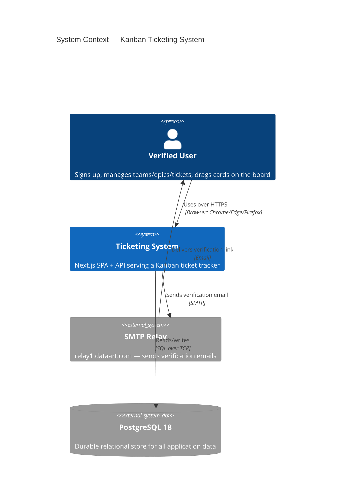
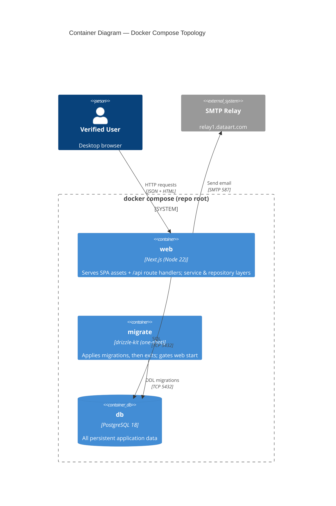
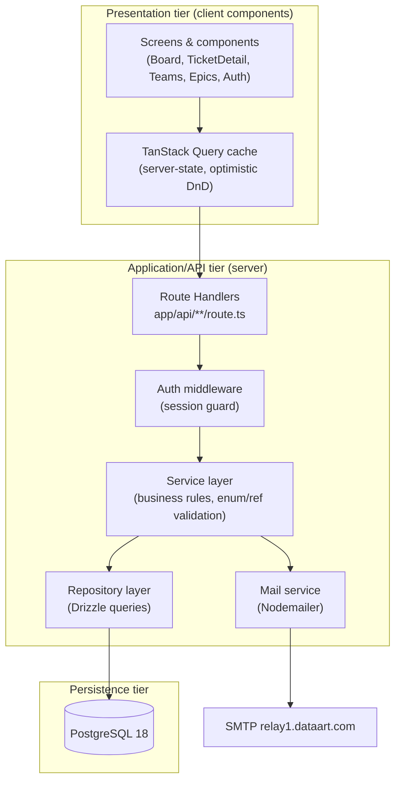
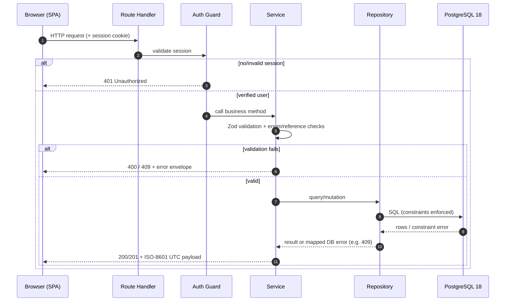
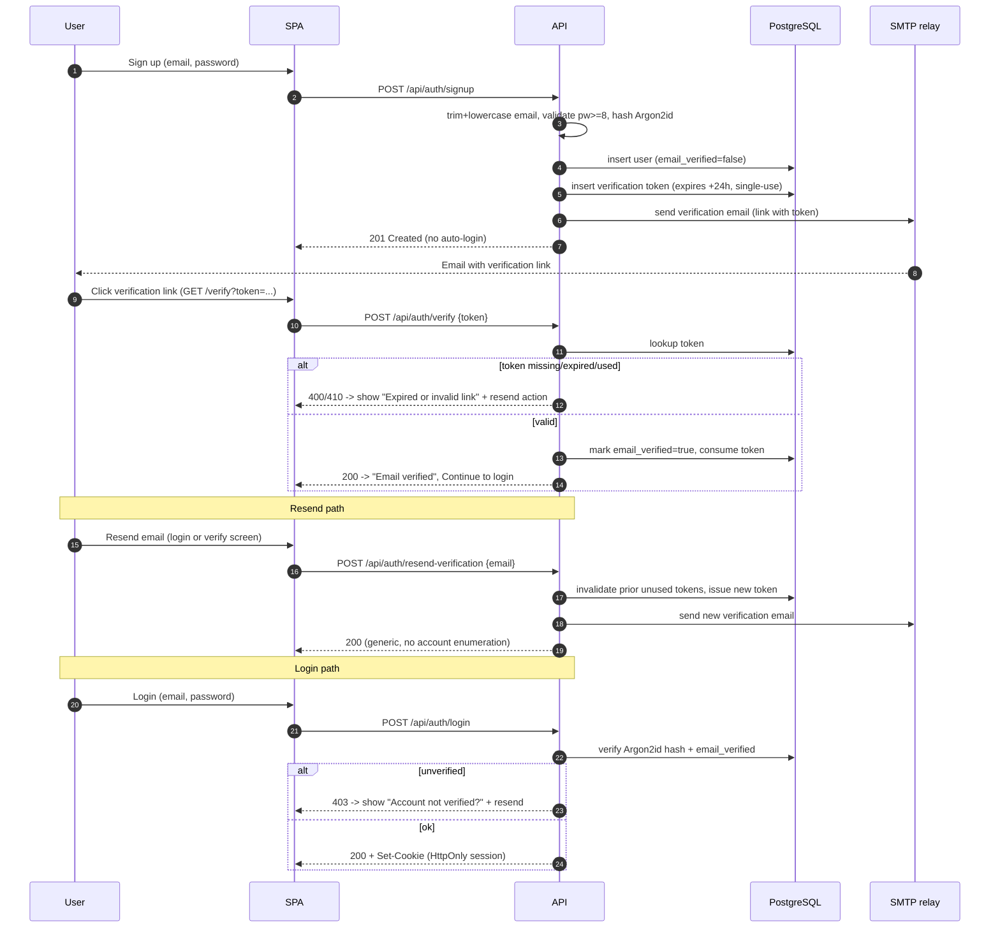
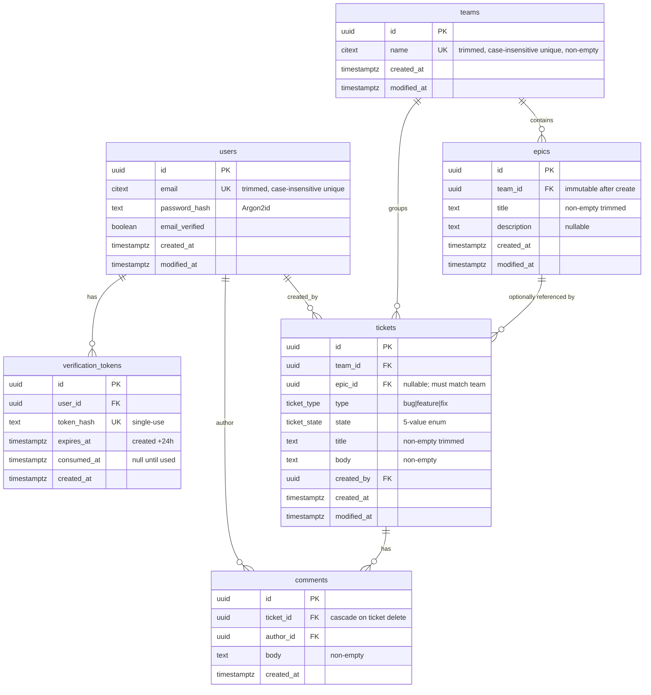
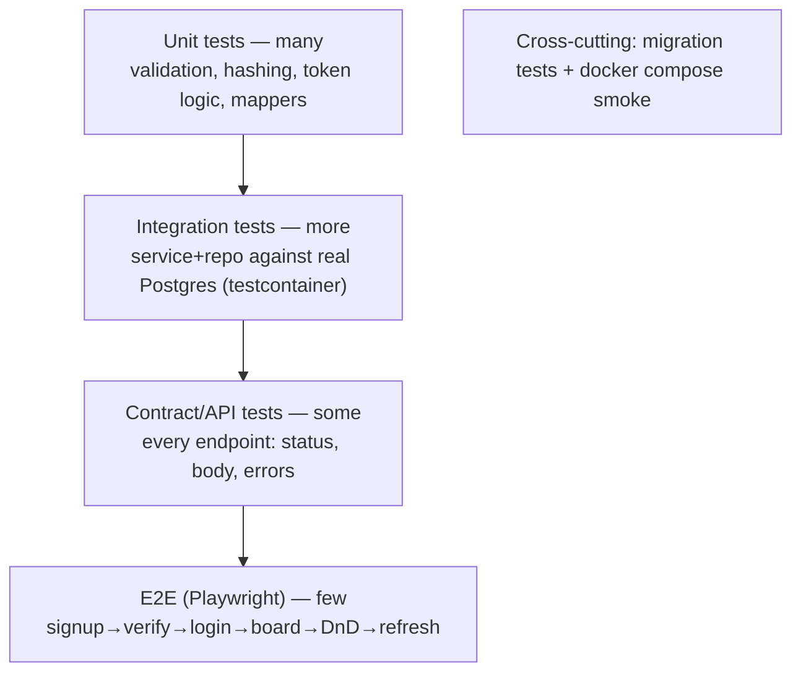

# Implementation Plan — Kanban Ticketing System

> **Spec-Driven Development (SDD) master plan.** This is the single source of truth
> for building the Hackathon Kanban Ticketing System. It is written as a pyramid:
> each level refines the one above it, and every requirement is traceable from the
> product overview down to an executable test.
>
> **Status:** Planning only — _no application code exists yet_. The repository was a
> clean checkout when this plan was authored.

| Meta | Value |
|------|-------|
| Source requirement | `Hackathon_Ticketing_System_Requirements_v3 1.docx` |
| Repository state at planning time | Empty (greenfield) — no `package.json`, no `docker-compose.yml`, no `docs/` |
| Plan owner | Senior full-stack architect |
| Plan version | 1.0 |
| Last updated | 2026-07-01 |

## Pyramid model (how to read this plan)

| Level | Name | Where it lives | Granularity |
|-------|------|----------------|-------------|
| L0 | Product / system overview | `docs/00-product/` + §2 | Why the system exists |
| L1 | Main architecture components | `docs/01-architecture/` + §2 | The four tiers and how they talk |
| L2 | Component specifications | `docs/02..06/` + §3–§6 | One spec per component (DB, backend, frontend, devops) |
| L3 | Feature specifications | `docs/03-backend/features/`, `docs/04-frontend/screens/` | One spec per feature/screen |
| L4 | Implementation tasks | §7 roadmap steps + `docs/07-decisions/` | Concrete code-changing units |
| L5 | Test tasks & acceptance checks | §6 + §7 verification blocks + `docs/05-testing/` | Executable proof a level is done |

### Glossary / canonical values (locked)

- **Ticket type enum:** `bug | feature | fix` (exactly these three; classification only).
- **Ticket state enum (canonical API values):** `new | ready_for_implementation | in_progress | ready_for_acceptance | done`.
- **UI state labels:** New, Ready for Implementation, In Progress, Ready for Acceptance, Done.
- **Board column order:** New → Ready for Implementation → In Progress → Ready for Acceptance → Done.
- **Within-column order:** most recently modified first (no persisted manual order).
- **All timestamps:** stored and returned in UTC, serialized as ISO-8601.
- **Verification token lifetime:** 24h, single-use, re-issuing invalidates earlier unused tokens.
- **Password rule:** ≥ 8 characters, hashed with Argon2id, never stored in plain text.

---

# 1. Documentation tree

All design docs live under `docs/`. Each file has a single **owner** (who keeps it
correct) and known **consumers** (who depend on it). Dependencies are listed so that
a change ripples in a predictable direction (L0 → L5, never upward).

```text
docs/
├── planning/
│   └── IMPLEMENTATION_PLAN.md        ← this file (master index for everything below)
├── 00-product/
│   ├── overview.md                   ← L0 product/system overview
│   ├── scope.md                      ← in-scope vs out-of-scope (locked)
│   ├── glossary.md                   ← canonical enums, labels, terms
│   └── definition-of-done.md         ← the 10 DoD checkboxes, expanded & owned
├── 01-architecture/
│   ├── overview.md                   ← L1 tiers, boundaries, deployment model
│   ├── diagrams.md                   ← all Mermaid diagrams (C4 context/container, flows, ERD)
│   ├── auth-strategy.md              ← session vs bearer decision + cookie/session detail
│   ├── tech-stack.md                 ← Next.js, TS, Drizzle, Postgres 18, Argon2id rationale
│   └── adr-index.md                  ← links to 07-decisions ADRs
├── 02-database/
│   ├── schema.md                     ← L2 full schema spec (tables/columns/types/constraints)
│   ├── migrations.md                 ← migration tool, naming, ordering, idempotency, metadata
│   ├── constraints-and-indexes.md    ← uniqueness (case-insensitive), FKs, RESTRICT/CASCADE, indexes
│   └── enums.md                      ← ticket_type / ticket_state enum strategy
├── 03-backend/
│   ├── overview.md                   ← L2 backend component spec (runtime, layering, error model)
│   ├── api-conventions.md            ← status codes, error envelope, validation, pagination
│   ├── validation.md                 ← Zod schemas, server-side-first rule
│   ├── security.md                   ← session handling, CSRF, rate limiting, secret handling
│   └── features/                     ← L3 one spec per backend feature
│       ├── auth-signup.md
│       ├── auth-login-logout.md
│       ├── email-verification.md
│       ├── teams.md
│       ├── epics.md
│       ├── tickets.md
│       ├── comments.md
│       ├── board-query.md
│       └── health.md
├── 04-frontend/
│   ├── overview.md                   ← L2 frontend component spec (routing, data layer, design tokens)
│   ├── state-management.md           ← server-state (TanStack Query) + local UI state rules
│   ├── components.md                 ← shared component inventory (AppShell, Card, Dropdown…)
│   ├── accessibility.md              ← keyboard DnD, focus, ARIA, color/contrast
│   └── screens/                      ← L3 one spec per screen (mirrors wireframes)
│       ├── signup.md
│       ├── login.md
│       ├── verify-result.md
│       ├── board.md
│       ├── ticket-detail.md
│       ├── teams.md
│       └── epics.md
├── 05-testing/
│   ├── strategy.md                   ← L5 testing pyramid, tools, coverage targets
│   ├── unit.md
│   ├── integration.md
│   ├── contract-api.md
│   ├── e2e.md
│   ├── migration-tests.md
│   └── compose-smoke.md
├── 06-devops/
│   ├── docker-compose.md             ← services, env, healthchecks, startup ordering
│   ├── environment.md                ← env var catalogue (.env.example), SMTP config
│   ├── runbook.md                    ← README content: prerequisites, config, startup
│   └── ci.md                         ← (optional) CI workflow for tests
└── 07-decisions/
    ├── 0001-orm-drizzle.md
    ├── 0002-auth-cookie-session.md
    ├── 0003-monorepo-single-nextjs-app.md
    ├── 0004-postgres-native-enums.md
    └── 0005-case-insensitive-uniqueness.md
```

### Per-document contract

| Document | Purpose | Owner | Consumers | Must contain | Depends on |
|----------|---------|-------|-----------|--------------|------------|
| `00-product/overview.md` | Frame the product (L0) | Architect | Everyone | Objective, three-tier mandate, primary user journey | requirements docx |
| `00-product/scope.md` | Lock scope | Architect | All | In-scope list, explicit out-of-scope (Scrum/SSO/RBAC/etc.) | overview |
| `00-product/glossary.md` | Canonical vocabulary | Architect | DB, backend, frontend | Enum values + UI labels, timestamp rule, token rule | requirements |
| `00-product/definition-of-done.md` | Acceptance gate | Architect/QA | All | 10 DoD items expanded with owner + verifying test | overview, testing strategy |
| `01-architecture/overview.md` | Tier boundaries (L1) | Architect | Backend, frontend, devops | Tier responsibilities, deployment model, data ownership | product |
| `01-architecture/diagrams.md` | Visual contracts | Architect | All | All Mermaid diagrams (see §2) | overview |
| `01-architecture/auth-strategy.md` | Session model | Backend lead | Backend, frontend | Cookie/session decision, lifetimes, logout, no-token-in-URL rule | security, ADR-0002 |
| `01-architecture/tech-stack.md` | Tech choices | Architect | All | Versions, rationale, alternatives rejected | ADRs |
| `02-database/schema.md` | Schema of record (L2) | DB owner | Backend, testing | All tables, columns, types, defaults | glossary, requirements §5–§7 |
| `02-database/migrations.md` | Repeatable init | DB owner | Devops, testing | Tool, file naming, ordering, no-seed rule, metadata table | schema |
| `02-database/constraints-and-indexes.md` | Integrity rules | DB owner | Backend, testing | Unique/FK/RESTRICT/CASCADE, indexes, partial indexes | schema, enums |
| `02-database/enums.md` | Enum strategy | DB owner | Backend, frontend | Native PG enums + migration approach for additions | glossary |
| `03-backend/overview.md` | Backend spec (L2) | Backend lead | Frontend, testing | Layering (route→service→repo), error model, runtime | architecture |
| `03-backend/api-conventions.md` | Wire contract | Backend lead | Frontend, testing | Status codes, error envelope, ISO-8601, ID format | overview |
| `03-backend/validation.md` | Validation rules | Backend lead | Frontend, testing | Zod schema catalogue, trimming, server-first rule | api-conventions |
| `03-backend/security.md` | Security controls | Backend lead | Devops | Hashing, session cookie flags, CSRF, secrets, rate limit | auth-strategy |
| `03-backend/features/*.md` | Feature spec (L3) | Backend lead | Testing, frontend | Endpoints, bodies, validation, status, errors, tests | overview, schema |
| `04-frontend/overview.md` | Frontend spec (L2) | Frontend lead | Testing | Routing, data layer, design tokens, shell layout | architecture |
| `04-frontend/state-management.md` | State rules | Frontend lead | Frontend devs | Server-state cache, optimistic DnD, rollback rule | overview |
| `04-frontend/components.md` | Shared components | Frontend lead | Frontend devs | Component inventory + props contract | overview |
| `04-frontend/accessibility.md` | A11y rules | Frontend lead | Testing | Keyboard DnD, ARIA roles, focus management | overview |
| `04-frontend/screens/*.md` | Screen spec (L3) | Frontend lead | Testing | Route, layout, components, states, a11y, tests | overview, backend features |
| `05-testing/strategy.md` | Test plan (L5) | QA lead | All | Pyramid, tools, coverage targets, CI gates | all specs |
| `05-testing/*.md` | Per-layer plans | QA lead | Devs | Concrete cases per layer | strategy + relevant feature spec |
| `06-devops/docker-compose.md` | Compose spec | Devops | All | Services, healthchecks, ordering, build | architecture |
| `06-devops/environment.md` | Env catalogue | Devops | Backend | Every env var, `.env.example`, SMTP relay1 config | security |
| `06-devops/runbook.md` | README source | Devops | QA | Prereqs, config, `docker compose up --build` | docker-compose |
| `06-devops/ci.md` | CI pipeline | Devops | QA | Lint/test/build stages | testing strategy |
| `07-decisions/*.md` | ADRs (L4 rationale) | Architect | All | Context, decision, consequences, alternatives | architecture |

> **Authoring rule:** A document at level _N_ may only be marked complete when every
> document it depends on (lower number / higher in the pyramid) is complete. This is
> enforced in the tracking tables in §9.

---

# 2. System architecture

## 2.1 Tier responsibilities (L1)

The system is a **single Next.js application** that cleanly separates three logical
tiers, fronted by a dedicated PostgreSQL 18 container. Even though one Next.js process
serves both the SPA and the API, the tiers are kept separate by directory and module
boundaries (see ADR-0003).

| Tier | Responsibility | Implementation | Must NOT |
|------|----------------|----------------|----------|
| Presentation (SPA) | Render screens, client interactions, drag-and-drop, client-side filtering | Next.js App Router client components + TanStack Query | Be the system of record; no `localStorage` for app data |
| Application / API | Business logic, validation, auth, persistence orchestration | Next.js Route Handlers (`app/api/**/route.ts`) → service layer → repository layer | Trust client-only validation |
| Persistence | Durable relational storage, integrity constraints | PostgreSQL 18 container | Be bypassed by the client |

**Deployment model (chosen):** the backend serves the compiled SPA from one container
(`web`), and a separate `db` container runs PostgreSQL 18. A short-lived `migrate`
step runs migrations before `web` accepts traffic. SMTP is **not** containerized — the
app talks to an external relay (`relay1.dataart.com`) configurable via env. This
satisfies "may be deployed as separate containers, or the backend may serve the
compiled SPA, provided the three logical tiers remain clearly separated."

## 2.2 Tech stack (locked — see §11 and ADRs)

| Concern | Choice | Why |
|---------|--------|-----|
| Language | TypeScript (strict) | Type-safety across tiers, shared types |
| Framework (FE+BE) | Next.js (App Router) | One toolchain serves SPA + API; satisfies three-tier separation |
| ORM / migrations | **Drizzle ORM + drizzle-kit** | SQL-first control over native PG enums, CHECK constraints, partial/functional unique indexes, and `ON DELETE RESTRICT` — all required here (see ADR-0001) |
| Database | PostgreSQL 18 (container) | Required RDBMS; native enums, `citext`/functional indexes |
| Password hashing | Argon2id (`@node-rs/argon2`) | Required established algorithm |
| Validation | Zod | Server-side schema validation reused for typed responses |
| Server state | TanStack Query | Cache, optimistic DnD, refetch-on-focus |
| Drag & drop | `@dnd-kit/core` | Accessible (keyboard) DnD |
| Email | Nodemailer (SMTP) | Talks to configurable relay incl. relay1.dataart.com |
| Tests | Vitest (unit/integration), Supertest-style route tests, Playwright (E2E) | Covers full pyramid |
| Container | Docker + Docker Compose | `docker compose up --build` from repo root |

## 2.3 C4 — System context diagram



## 2.4 C4 — Container diagram



## 2.5 Layered module view (inside `web`)



## 2.6 Request flow (authenticated API call)



## 2.7 Authentication & email-verification flow



## 2.8 Ticket state-change flow (drag-and-drop)

```mermaid
stateDiagram-v2
    [*] --> new
    new --> ready_for_implementation
    new --> in_progress
    new --> ready_for_acceptance
    new --> done
    ready_for_implementation --> in_progress
    ready_for_implementation --> new
    in_progress --> ready_for_acceptance
    in_progress --> new
    ready_for_acceptance --> done
    ready_for_acceptance --> in_progress
    done --> in_progress
    note right of done
        Any state may move to any other state.
        Sequential transitions are NOT enforced.
        On drop: PATCH state; on failure card
        returns to previous column + error shown.
        modified_at advances only on real change.
    end note
```



## 2.9 Database ERD



## 2.10 Testing pyramid



> Diagram source of truth: these blocks are mirrored into
> `docs/01-architecture/diagrams.md` and must be kept in sync with this section.

---

# 3. Database plan (PostgreSQL 18)

## 3.1 Conventions

- **IDs:** `uuid` primary keys, default `gen_random_uuid()` (built-in in PG 18; no extension needed). Stable and unique per requirements.
- **Timestamps:** every timestamp column is `timestamptz` (stored UTC). App sets values via `now()` at write time; the API serializes to ISO-8601 UTC (`...Z`). `modified_at` is updated by the **service layer** only on a real field/state change — _not_ by a blanket DB trigger — so that "saving unchanged values must not advance it" and "adding a comment does not change the ticket" hold.
- **Case-insensitive uniqueness:** the `citext` extension is enabled and used for `users.email` and `teams.name`. Values are trimmed in the service layer before insert. A plain `UNIQUE` on a `citext` column then gives case-insensitive uniqueness. (Alternative documented in ADR-0005: `UNIQUE (lower(col))` functional index if `citext` is disallowed.)
- **Enums:** native PostgreSQL `CREATE TYPE ... AS ENUM` for `ticket_type` and `ticket_state` (see §3.4).
- **Non-empty text:** enforced with `CHECK (length(btrim(col)) > 0)` at the DB level _and_ trimmed/validated in the service layer.
- **Delete rules:** `ON DELETE RESTRICT` everywhere referential deletion must be blocked; `ON DELETE CASCADE` only for `comments.ticket_id`.

## 3.2 Tables, columns, types, constraints

### `users`
| Column | Type | Constraints |
|--------|------|-------------|
| `id` | `uuid` | PK, default `gen_random_uuid()` |
| `email` | `citext` | `NOT NULL`, `UNIQUE`, `CHECK (length(btrim(email)) > 0)` |
| `password_hash` | `text` | `NOT NULL` (Argon2id encoded string) |
| `email_verified` | `boolean` | `NOT NULL DEFAULT false` |
| `created_at` | `timestamptz` | `NOT NULL DEFAULT now()` |
| `modified_at` | `timestamptz` | `NOT NULL DEFAULT now()` |

### `verification_tokens`
| Column | Type | Constraints |
|--------|------|-------------|
| `id` | `uuid` | PK, default `gen_random_uuid()` |
| `user_id` | `uuid` | `NOT NULL`, FK → `users(id)` `ON DELETE CASCADE` |
| `token_hash` | `text` | `NOT NULL`, `UNIQUE` (store hash, not raw token) |
| `expires_at` | `timestamptz` | `NOT NULL` (created_at + 24h) |
| `consumed_at` | `timestamptz` | `NULL` until used (single-use) |
| `created_at` | `timestamptz` | `NOT NULL DEFAULT now()` |

> Token in the URL is the raw single-use token; the DB stores only a hash. "Issuing a new token invalidates earlier unused tokens" is implemented by deleting/marking-consumed all prior unconsumed tokens for that user in the same transaction.

### `teams`
| Column | Type | Constraints |
|--------|------|-------------|
| `id` | `uuid` | PK, default `gen_random_uuid()` |
| `name` | `citext` | `NOT NULL`, `UNIQUE`, `CHECK (length(btrim(name)) > 0)` |
| `created_at` | `timestamptz` | `NOT NULL DEFAULT now()` |
| `modified_at` | `timestamptz` | `NOT NULL DEFAULT now()` |

### `epics`
| Column | Type | Constraints |
|--------|------|-------------|
| `id` | `uuid` | PK, default `gen_random_uuid()` |
| `team_id` | `uuid` | `NOT NULL`, FK → `teams(id)` `ON DELETE RESTRICT` (immutable after create) |
| `title` | `text` | `NOT NULL`, `CHECK (length(btrim(title)) > 0)` |
| `description` | `text` | `NULL` |
| `created_at` | `timestamptz` | `NOT NULL DEFAULT now()` |
| `modified_at` | `timestamptz` | `NOT NULL DEFAULT now()` |

### `tickets`
| Column | Type | Constraints |
|--------|------|-------------|
| `id` | `uuid` | PK, default `gen_random_uuid()` |
| `team_id` | `uuid` | `NOT NULL`, FK → `teams(id)` `ON DELETE RESTRICT` |
| `epic_id` | `uuid` | `NULL`, FK → `epics(id)` `ON DELETE RESTRICT` |
| `type` | `ticket_type` | `NOT NULL` (enum) |
| `state` | `ticket_state` | `NOT NULL DEFAULT 'new'` (enum) |
| `title` | `text` | `NOT NULL`, `CHECK (length(btrim(title)) > 0)` |
| `body` | `text` | `NOT NULL`, `CHECK (length(btrim(body)) > 0)` |
| `created_by` | `uuid` | `NOT NULL`, FK → `users(id)` `ON DELETE RESTRICT` |
| `created_at` | `timestamptz` | `NOT NULL DEFAULT now()` |
| `modified_at` | `timestamptz` | `NOT NULL DEFAULT now()` |

> **Cross-team epic rule** ("a ticket may reference only an epic that belongs to the same team") cannot be expressed by a simple single-column FK. Enforced by **both**: (a) service-layer check before write, and (b) a database guarantee via a composite FK. To enable the composite FK, add a redundant `UNIQUE (id, team_id)` on both `teams` and `epics`, then declare `tickets` FK `(epic_id, team_id)` → `epics(id, team_id)`. This makes the DB reject a ticket whose epic belongs to another team even under concurrency.

### `comments`
| Column | Type | Constraints |
|--------|------|-------------|
| `id` | `uuid` | PK, default `gen_random_uuid()` |
| `ticket_id` | `uuid` | `NOT NULL`, FK → `tickets(id)` `ON DELETE CASCADE` |
| `author_id` | `uuid` | `NOT NULL`, FK → `users(id)` `ON DELETE RESTRICT` |
| `body` | `text` | `NOT NULL`, `CHECK (length(btrim(body)) > 0)` |
| `created_at` | `timestamptz` | `NOT NULL DEFAULT now()` |

### `__drizzle_migrations` (migration metadata)
Managed by drizzle-kit. Allowed to exist in a "fresh" DB; it is _metadata_, not application data.

## 3.3 Delete restrictions & cascade rules (summary)

| Relationship | Rule | Rationale (requirement) |
|--------------|------|--------------------------|
| `epics.team_id` → teams | `RESTRICT` | Team cannot be deleted while it has epics → 409 |
| `tickets.team_id` → teams | `RESTRICT` | Team cannot be deleted while it has tickets → 409 |
| `tickets.epic_id` → epics | `RESTRICT` | Epic cannot be deleted while referenced by tickets → 409 |
| `tickets.created_by` → users | `RESTRICT` | Preserve authorship integrity |
| `comments.ticket_id` → tickets | `CASCADE` | Deleting a ticket deletes its comments |
| `comments.author_id` → users | `RESTRICT` | Preserve authorship integrity |
| `verification_tokens.user_id` → users | `CASCADE` | Tokens are owned wholly by the user |

> The backend maps `RESTRICT` violations (SQLSTATE `23503` foreign_key_violation) to **HTTP 409 Conflict** with a clear message. Service layer also pre-checks counts to produce friendly messages and to drive disabled UI delete buttons.

## 3.4 Enum strategy

```sql
CREATE TYPE ticket_type  AS ENUM ('bug', 'feature', 'fix');
CREATE TYPE ticket_state AS ENUM ('new', 'ready_for_implementation', 'in_progress', 'ready_for_acceptance', 'done');
```

- Canonical lowercase/underscore values are the API contract; the UI maps to human labels.
- Adding a value later is a migration (`ALTER TYPE ... ADD VALUE`); out of scope but documented in `enums.md`.
- Drizzle's `pgEnum` mirrors these so application types stay in sync; the service layer rejects unknown values with 400 before they reach the DB (defense in depth).

## 3.5 Indexes

| Index | Table | Purpose |
|-------|-------|---------|
| `users_email_key` (UNIQUE on citext) | users | login lookup + case-insensitive uniqueness |
| `teams_name_key` (UNIQUE on citext) | teams | case-insensitive team-name uniqueness |
| `teams_id_team_unique` (`UNIQUE(id)` already PK; plus `UNIQUE(id)` reused) | teams | composite FK target |
| `epics_id_team_id_key` (`UNIQUE(id, team_id)`) | epics | target for tickets composite FK |
| `epics_team_id_idx` | epics | list epics by team |
| `tickets_team_state_modified_idx` (`team_id, state, modified_at DESC`) | tickets | board query (columns + within-column ordering) |
| `tickets_team_id_idx` | tickets | team delete pre-check, filtering |
| `tickets_epic_id_idx` | tickets | epic delete pre-check, filter by epic |
| `tickets_title_trgm_idx` (GIN `pg_trgm` on `lower(title)`) | tickets | case-insensitive substring search (scales to 100+ tickets) |
| `comments_ticket_id_created_at_idx` | comments | chronological comment load (oldest first) |
| `verification_tokens_token_hash_key` (UNIQUE) | verification_tokens | token lookup |
| `verification_tokens_user_id_idx` | verification_tokens | invalidate prior tokens |

## 3.6 Migration metadata & fresh-DB guarantee

- Migrations are forward-only SQL files generated by drizzle-kit under `db/migrations/`.
- Extensions enabled in the first migration: `citext`, `pg_trgm`. (`gen_random_uuid()` is built into PG 18.)
- A fresh DB after migration contains **only** schema objects + `__drizzle_migrations` rows. **No seed/demo application data** is loaded on the default startup path (requirement §9, DoD #9).
- Verified by the migration test and compose smoke test (§6): after `up`, `SELECT count(*)` on each application table = 0.

---

# 4. Backend / API plan

Implemented with Next.js **Route Handlers** (`app/api/**/route.ts`). Layering:
`route handler` (HTTP) → `service` (business rules, validation, enum/reference checks)
→ `repository` (Drizzle). All mutations go through the API and persist in Postgres.

## 4.1 Conventions

- **Base path:** `/api`. **Content type:** `application/json`.
- **IDs in URLs:** UUIDs. **No** session id / token in URLs (verification token is the only token allowed in a URL, single-use).
- **Auth:** HttpOnly, `Secure`, `SameSite=Lax` cookie session (see ADR-0002). Guard runs on every endpoint except the public ones below.
- **Timestamps:** all responses use ISO-8601 UTC strings.
- **Error envelope:**
  ```json
  { "error": { "code": "VALIDATION_ERROR", "message": "Human readable", "fields": { "email": "Email is required" } } }
  ```
- **Standard status codes:** `200` ok, `201` created, `204` no content, `400` validation, `401` unauthenticated, `403` unverified/forbidden, `404` not found, `409` conflict (delete-restrict / uniqueness), `410` gone (expired token), `422` reserved, `500` unexpected.
- **Public endpoints (no auth):** signup, login, logout, verify, resend-verification, health/ready, static assets. Everything else requires a verified session.

## 4.2 Authentication endpoints

### `POST /api/auth/signup`
- **Auth:** public.
- **Body:** `{ "email": string, "password": string, "confirmPassword": string }`
- **Validation:** email trimmed, valid format, lowercased, unique (case-insensitive); password ≥ 8 chars; `password === confirmPassword`.
- **Behavior:** hash with Argon2id; insert user (`email_verified=false`); create verification token (+24h); send email via SMTP; **no auto-login**.
- **Response 201:** `{ "id", "email", "emailVerified": false }`
- **Errors:** `400` invalid input; `409` email already registered (generic message to limit enumeration); `500` mail/db failure (user still created? — see feature spec: create user + token in txn, queue mail; mail failure returns 202-style warning but token resend available).
- **Tests:** unit (password rule, email normalize), integration (duplicate email → 409), contract (201 shape), e2e (signup step).

### `POST /api/auth/login`
- **Auth:** public.
- **Body:** `{ "email": string, "password": string }`
- **Validation:** required fields.
- **Behavior:** lookup by case-insensitive email; verify Argon2id hash; require `email_verified=true`; on success issue session cookie.
- **Response 200:** `{ "id", "email" }` + `Set-Cookie`.
- **Errors:** `400` missing fields; `401` bad credentials (generic); `403` `ACCOUNT_NOT_VERIFIED` (drives "Resend email" UI).
- **Tests:** unit (hash compare), integration (unverified → 403, wrong pw → 401), contract, e2e (login step).

### `POST /api/auth/logout`
- **Auth:** authenticated.
- **Body:** none.
- **Behavior:** invalidate/clear session cookie.
- **Response 204.**
- **Errors:** `401` if no session.
- **Tests:** integration (cookie cleared), e2e (logout from user menu).

### `GET /api/auth/me`
- **Auth:** authenticated.
- **Response 200:** `{ "id", "email", "emailVerified" }` — used by SPA to bootstrap session.
- **Errors:** `401`.
- **Tests:** contract, integration.

## 4.3 Verification endpoints

### `POST /api/auth/verify`
- **Auth:** public.
- **Body:** `{ "token": string }` (raw token from link).
- **Validation:** token present.
- **Behavior:** hash token, look up; check not consumed and `expires_at > now()`; mark user verified + consume token in txn.
- **Response 200:** `{ "verified": true }`.
- **Errors:** `400` malformed; `410` `TOKEN_EXPIRED_OR_INVALID` (drives "Expired or invalid link" + resend); idempotency: already-consumed → `410`.
- **Tests:** unit (expiry math, single-use), integration (expired/used → 410), contract, e2e (verify success + invalid).

### `POST /api/auth/resend-verification`
- **Auth:** public.
- **Body:** `{ "email": string }`
- **Behavior:** if an unverified user exists, invalidate prior unused tokens, issue new token, send email. **Always** return generic success (no account enumeration). Rate-limited.
- **Response 200:** `{ "ok": true }`.
- **Errors:** `400` invalid email; `429` rate limited.
- **Tests:** unit (prior-token invalidation), integration (old token then becomes invalid), contract.

## 4.4 Teams CRUD

### `GET /api/teams`
- **Auth:** required. **Response 200:** `[{ "id","name","createdAt","modifiedAt","ticketCount","epicCount","canDelete" }]` (counts drive disabled delete buttons). Sorted by name. Tests: contract, integration.

### `POST /api/teams`
- **Auth:** required. **Body:** `{ "name": string }`. **Validation:** trimmed non-empty, case-insensitive unique. **201:** team object. **Errors:** `400` empty; `409` duplicate name. Tests: unit (trim), integration (dup → 409), contract.

### `PATCH /api/teams/{id}`
- **Auth:** required. **Body:** `{ "name": string }`. **Validation:** non-empty, unique (excluding self). Updates `modified_at` only if changed. **200:** team. **Errors:** `400`, `404`, `409`. Tests: integration (rename collision → 409, no-op keeps modified_at), contract.

### `DELETE /api/teams/{id}`
- **Auth:** required. **Behavior:** reject if team has tickets or epics. **204** on success. **Errors:** `404`; `409` `TEAM_NOT_EMPTY`. Tests: integration (with ticket/epic → 409; empty → 204), contract.

## 4.5 Epics CRUD

### `GET /api/epics?teamId={uuid}`
- **Auth:** required. **Query:** `teamId` required. **Response 200:** `[{ "id","teamId","title","description","createdAt","modifiedAt","ticketCount","canDelete" }]`. **Errors:** `400` missing teamId. Tests: contract, integration.

### `POST /api/epics`
- **Auth:** required. **Body:** `{ "teamId": uuid, "title": string, "description"?: string|null }`. **Validation:** team exists; title trimmed non-empty. Team is set at create and **immutable**. **201:** epic. **Errors:** `400`, `404` team missing. Tests: unit (title trim), integration, contract.

### `PATCH /api/epics/{id}`
- **Auth:** required. **Body:** `{ "title"?: string, "description"?: string|null }` (**teamId not editable**). **Validation:** title non-empty if present. Updates `modified_at` only on real change. **200:** epic. **Errors:** `400`, `404`. Tests: integration (team change ignored/rejected), contract.

### `DELETE /api/epics/{id}`
- **Auth:** required. **Behavior:** reject if tickets reference it. **204** success. **Errors:** `404`; `409` `EPIC_REFERENCED`. Tests: integration (referenced → 409), contract.

## 4.6 Tickets CRUD

### `POST /api/tickets`
- **Auth:** required.
- **Body:** `{ "teamId": uuid, "type": ticket_type, "title": string, "body": string, "state"?: ticket_state, "epicId"?: uuid|null }`
- **Validation:** team exists; `type` ∈ enum; `state` ∈ enum (default `new`); title & body non-empty after trim; if `epicId` set, epic exists **and** belongs to `teamId` (server-enforced + DB composite FK). `created_by` from session.
- **Response 201:** full ticket object (incl. `createdBy`, `createdAt`, `modifiedAt`).
- **Errors:** `400` bad enum / empty / cross-team epic; `404` team/epic missing.
- **Tests:** unit (enum validation), integration (cross-team epic → 400, defaults), contract, e2e (create from board).

### `GET /api/tickets/{id}`
- **Auth:** required. **Response 200:** full ticket + author email + epic title (for detail view). **Errors:** `404`. Tests: contract, integration.

### `PATCH /api/tickets/{id}`
- **Auth:** required.
- **Body (all optional):** `{ "type", "teamId", "epicId", "title", "body", "state" }`.
- **Validation:** enums validated; if `teamId` changes, `epicId` must be null or belong to new team (UI clears epic, backend rejects mismatch); non-empty title/body.
- **modified_at:** advances **only** if at least one field actually changes value (no-op save keeps it).
- **Response 200:** updated ticket. **Errors:** `400` (bad enum / cross-team epic / empty), `404`. Tests: unit (no-op detection), integration (cross-team epic → 400, modified_at semantics), contract, e2e.

### `PATCH /api/tickets/{id}/state`
- **Auth:** required. **Purpose:** dedicated drag-and-drop state update (small, fast).
- **Body:** `{ "state": ticket_state }`.
- **Validation:** state ∈ enum. Any state→any state allowed.
- **Behavior:** persist immediately; advance `modified_at`; return updated ticket so the board can re-sort.
- **Response 200:** `{ "id","state","modifiedAt" }`. **Errors:** `400` invalid state; `404`. **Failure contract:** any non-2xx → frontend reverts card to previous column + shows error.
- **Tests:** unit (enum), integration (persists; refresh shows new column), contract, e2e (drag persists across refresh).

### `DELETE /api/tickets/{id}`
- **Auth:** required. **Behavior:** explicit confirm on UI; cascade-deletes comments. **204.** **Errors:** `404`. Tests: integration (comments gone), contract, e2e (delete with confirm).

## 4.7 Comments

### `GET /api/tickets/{id}/comments`
- **Auth:** required. **Response 200:** `[{ "id","author":{"id","email"},"body","createdAt" }]` ordered oldest-first. **Errors:** `404` ticket. Tests: contract, integration (ordering).

### `POST /api/tickets/{id}/comments`
- **Auth:** required. **Body:** `{ "body": string }`. **Validation:** non-empty trimmed. **Behavior:** author = session user; **does not** touch ticket `modified_at`. **201:** comment. **Errors:** `400` empty; `404` ticket. Tests: unit (non-empty), integration (ticket modified_at unchanged), contract, e2e (post comment).

> Comment edit/delete are stretch — not implemented in mandatory scope.

## 4.8 Kanban board query endpoint

### `GET /api/board?teamId={uuid}&type={enum}&epicId={uuid}&q={string}`
- **Auth:** required.
- **Query:** `teamId` required; optional `type`, `epicId`, `q` (case-insensitive substring over title). Filters combined with AND.
- **Behavior:** returns tickets for the team grouped by state, each column ordered by `modified_at DESC`. Includes per-column counts and total. Designed to stay usable at 100+ tickets (indexed query; pagination-ready).
- **Response 200:**
  ```json
  {
    "teamId": "…",
    "total": 42,
    "columns": {
      "new": { "count": 8, "tickets": [ { "id","title","type","epicTitle","modifiedAt" } ] },
      "ready_for_implementation": { "count": 6, "tickets": [] },
      "in_progress": { "count": 9, "tickets": [] },
      "ready_for_acceptance": { "count": 5, "tickets": [] },
      "done": { "count": 14, "tickets": [] }
    }
  }
  ```
- **Errors:** `400` missing/invalid teamId or bad enum filter. Tests: contract (shape + all 5 columns present even when empty), integration (filters AND, search case-insensitive, ordering), e2e.

## 4.9 Health / readiness

### `GET /api/health` (liveness)
- **Auth:** public. **200:** `{ "status": "ok" }`. Tests: contract, compose smoke.

### `GET /api/ready` (readiness)
- **Auth:** public. **Behavior:** checks DB connectivity (`SELECT 1`). **200** `{ "status":"ready" }` / **503** `{ "status":"not_ready" }`. Used by compose healthcheck/startup gating. Tests: integration (db down → 503), compose smoke.

## 4.10 Endpoint summary table

| Method | URL | Auth | Success | Key errors |
|--------|-----|------|---------|-----------|
| POST | /api/auth/signup | public | 201 | 400, 409 |
| POST | /api/auth/login | public | 200 | 400, 401, 403 |
| POST | /api/auth/logout | auth | 204 | 401 |
| GET | /api/auth/me | auth | 200 | 401 |
| POST | /api/auth/verify | public | 200 | 400, 410 |
| POST | /api/auth/resend-verification | public | 200 | 400, 429 |
| GET | /api/teams | auth | 200 | 401 |
| POST | /api/teams | auth | 201 | 400, 409 |
| PATCH | /api/teams/{id} | auth | 200 | 400, 404, 409 |
| DELETE | /api/teams/{id} | auth | 204 | 404, 409 |
| GET | /api/epics?teamId | auth | 200 | 400 |
| POST | /api/epics | auth | 201 | 400, 404 |
| PATCH | /api/epics/{id} | auth | 200 | 400, 404 |
| DELETE | /api/epics/{id} | auth | 204 | 404, 409 |
| POST | /api/tickets | auth | 201 | 400, 404 |
| GET | /api/tickets/{id} | auth | 200 | 404 |
| PATCH | /api/tickets/{id} | auth | 200 | 400, 404 |
| PATCH | /api/tickets/{id}/state | auth | 200 | 400, 404 |
| DELETE | /api/tickets/{id} | auth | 204 | 404 |
| GET | /api/tickets/{id}/comments | auth | 200 | 404 |
| POST | /api/tickets/{id}/comments | auth | 201 | 400, 404 |
| GET | /api/board?teamId | auth | 200 | 400 |
| GET | /api/health | public | 200 | — |
| GET | /api/ready | public | 200 | 503 |

---

# 5. Frontend plan

Next.js App Router SPA. Server-state via TanStack Query; forms validated client-side
for UX but **never** as the source of truth (backend re-validates everything).

## 5.1 App shell (from wireframes 1, 3, 4, 5)

A persistent header on all authenticated screens:
- Left: brand **"TICKET TRACKER"**.
- Center nav tabs: **Board · Teams · Epics** (active tab highlighted).
- Right: user menu showing the user's email with a caret; menu contains **Log out**.
- Body region renders the active route.

Design tokens: neutral/monochrome palette matching wireframes (white surfaces, near-black primary buttons, gray secondary). Type badges and counts are pill chips.

## 5.2 Shared components inventory

`AppShell/Header/NavTabs/UserMenu`, `Button` (primary/secondary/disabled), `TextField`, `PasswordField`, `Select`, `Textarea`, `Dialog/ConfirmDialog`, `Toast` (success/error), `Spinner/Skeleton`, `EmptyState`, `Badge` (type), `Pill` (count), `Card`, `Table`, `FieldError`, `AuthCard`. State rules in `04-frontend/state-management.md`.

## 5.3 Global state behavior

- **Loading:** skeletons for board columns/tables; button spinners on submit.
- **Empty:** column shows nothing but stays visible; tables show "No teams/epics yet"; board with no team selected prompts selection.
- **Success:** toast + cache invalidation/refetch.
- **Error:** inline field errors (validation) + toast for request errors; 401 → redirect to login; 403 unverified → resend prompt.
- **Refresh persistence:** all data comes from the API; a browser refresh re-fetches and shows identical state (no localStorage as system of record).

---

## 5.4 Screen: Sign-up  (wireframe 2 — center card)
- **Route:** `/signup`
- **Layout:** centered `AuthCard` "Create account", subtitle "Email verification is required."
- **Components:** Email `TextField`, Password `PasswordField` (placeholder "Minimum 8 characters"), Confirm password `PasswordField`, primary **Sign up** button, link "Already registered? Log in →".
- **State:** form values, submitting, field errors.
- **API:** `POST /api/auth/signup`.
- **Loading:** button spinner, inputs disabled.
- **Empty:** n/a.
- **Success:** show "Check your email to verify" confirmation; offer link to login.
- **Error:** `409` → "An account with this email may already exist"; `400` → inline (email format, pw < 8, mismatch).
- **Validation messages:** "Enter a valid email", "Password must be at least 8 characters", "Passwords do not match".
- **Accessibility:** labels tied via `htmlFor`; errors via `aria-describedby`; `aria-invalid`; submit on Enter.
- **Tests:** component (validation, mismatch), e2e (signup happy path).

## 5.5 Screen: Login  (wireframe 2 — left card)
- **Route:** `/login`
- **Layout:** centered `AuthCard` "Log in", subtitle "Use your verified account."
- **Components:** Email, Password, **Log in** button; "Account not verified?" with **Resend email** secondary button; link "Create an account →".
- **State:** form, submitting, errors, `showResend` flag.
- **API:** `POST /api/auth/login`; `POST /api/auth/resend-verification`.
- **Loading:** button spinners.
- **Empty:** n/a.
- **Success:** set session, redirect to `/board`.
- **Error:** `401` → "Incorrect email or password"; `403` → reveal resend block, message "Your account isn't verified yet."
- **Validation:** required fields.
- **Accessibility:** form landmark, error live region, focus first invalid field.
- **Tests:** component (403 reveals resend), e2e (login, unverified resend).

## 5.6 Screen: Email verification result  (wireframe 2 — right card)
- **Route:** `/verify?token=...`
- **Layout:** centered card. Success: check icon, "Email verified", "Your account is ready to use.", **Continue to login** button. Failure: "Expired or invalid link" with error text and **Resend email** action.
- **State:** `verifying | success | error`, optional email for resend.
- **API:** `POST /api/auth/verify` on mount; `POST /api/auth/resend-verification`.
- **Loading:** "Verifying…" spinner state.
- **Empty:** missing token → treat as error.
- **Success:** Continue to login → `/login`.
- **Error:** `410` → expired/invalid panel + resend.
- **Validation:** token presence.
- **Accessibility:** result announced via `role="status"`; icon `aria-hidden` with text alternative.
- **Tests:** component (success/expired branches), e2e (click link → verified; tampered token → error).

## 5.7 Screen: Kanban board  (wireframe 1 — primary screen)
- **Route:** `/board` (team selectable; e.g. `/board?teamId=...` to deep-link).
- **Layout:** Header. Controls row: **Team** `Select` (left), **+ New ticket** primary button (right). Filter bar: **Search title** input, **Type** select ("All types"), **Epic** select ("All epics"), **Clear** button, ticket count ("42 tickets"). Below: **five columns** in workflow order — NEW, READY FOR IMPLEMENTATION, IN PROGRESS, READY FOR ACCEPTANCE, DONE — each with a header label + count pill.
- **Components:** `TeamSelect`, `FilterBar`, `BoardColumn` ×5, `TicketCard` (type badge, title, `Epic: …`, relative time), `Button`, dnd context from `@dnd-kit`.
- **Cards:** show title + type (epic recommended, included). Ordered most-recently-modified first.
- **State:** selected teamId (persisted in URL + remembered locally as UI pref), filters (type/epic/q), board data (TanStack Query), drag state, optimistic move.
- **API:** `GET /api/board?teamId&type&epicId&q`; `GET /api/teams`; `GET /api/epics?teamId` (for epic filter + counts); `PATCH /api/tickets/{id}/state` on drop.
- **Loading:** column skeletons.
- **Empty:** no teams → prompt to create a team (link to Teams); team with no tickets → empty columns + hint; no team selected → "Select a team".
- **Success:** drop persists; card moves; count pills update.
- **Error:** failed drop → **card returns to previous column** + error toast (explicit requirement). Board load error → retry banner.
- **Validation:** filters constrained to valid enum/epic values.
- **Accessibility:** `@dnd-kit` keyboard sensors (move card via keyboard); columns are labelled lists (`aria-label`); live region announces moves; search input labelled.
- **Performance:** indexed board query; remains usable with ≥ 100 tickets; virtualization is a documented stretch.
- **Tests:** component (filter AND logic, search), e2e (drag persists across refresh; failed drop rollback; 100-ticket smoke).

## 5.8 Screen: Ticket create / edit / details  (wireframe 3)
- **Routes:** `/tickets/new?teamId=...` (create), `/tickets/{id}` (details/edit).
- **Layout:** "← Back to {Team}" link. Meta line: `TCK-id • Created by {author} • Created {ts} UTC • Modified {ts} UTC`. Title heading. Top-right **Delete** (secondary) + **Save** (primary). Two-column body: left = form (Team, Type, State selects; Epic select; Title input; Body textarea); right = **Comments** panel (see 5.9).
- **Components:** `Select` ×3, epic `Select`, `TextField`, `Textarea`, `Button`, `ConfirmDialog` (delete), `CommentsPanel`.
- **State:** ticket data, dirty tracking (to avoid no-op save advancing modified_at — backend also enforces), epic options filtered by selected team.
- **API:** create `POST /api/tickets`; load `GET /api/tickets/{id}`; save `PATCH /api/tickets/{id}`; delete `DELETE /api/tickets/{id}`; epics `GET /api/epics?teamId`.
- **Loading:** form skeleton; save/delete button spinners.
- **Empty:** new ticket → blank form defaulting state `new`.
- **Success:** save → toast + return to board (or stay) with updated values; delete (after confirm) → toast + back to board.
- **Error:** `400` cross-team epic / empty → inline; `404` → "Ticket not found".
- **Validation:** title & body non-empty; type/state required; **changing Team clears/replaces the selected epic** (UI) and backend rejects mismatched epic.
- **Accessibility:** labelled selects; confirm dialog focus-trapped; unsaved-changes consideration; UTC timestamps explicit.
- **Tests:** component (team change clears epic; required fields), integration via API mocks, e2e (create→edit→delete).

## 5.9 Comments panel  (wireframe 3 — right column)
- **Embedded in ticket detail.** Header "Comments" + count pill. List of comment cards (author bold, time right-aligned, body) **oldest first**. "Add comment" `Textarea` + **Post comment** primary button.
- **State:** comments list, new-comment text, submitting.
- **API:** `GET /api/tickets/{id}/comments`; `POST /api/tickets/{id}/comments`.
- **Loading:** list skeleton; button spinner.
- **Empty:** "No comments yet."
- **Success:** new comment appended; **ticket modified_at unchanged** → board order unaffected.
- **Error:** `400` empty → inline "Comment cannot be empty".
- **Validation:** non-empty trimmed.
- **Accessibility:** list semantics, textarea labelled, posted comment announced.
- **Tests:** component (empty validation, ordering), e2e (post comment shows author+timestamp).

## 5.10 Screen: Team management  (wireframe 4)
- **Route:** `/teams`
- **Layout:** Title "Teams" + caption "All verified users can view and manage all teams." + **+ Create team** button. Table columns: **Name, Tickets, Epics, Modified, Actions** (Edit, Delete). Helper text: "Delete is disabled while a team contains tickets or epics." Inline **Create team** panel (Team name field + Create) and edit-in-place/rename.
- **Components:** `Table`, `Button`, `TextField`, `ConfirmDialog`, inline edit form.
- **State:** teams list (with ticket/epic counts → `canDelete`), create form, edit form, submitting.
- **API:** `GET /api/teams`; `POST /api/teams`; `PATCH /api/teams/{id}`; `DELETE /api/teams/{id}`.
- **Loading:** table skeleton.
- **Empty:** "No teams yet — create your first team."
- **Success:** create/rename/delete → toast + refetch.
- **Error:** `409` duplicate name → inline; `409` non-empty delete → toast "Team has tickets or epics and can't be deleted."
- **Validation:** name non-empty, unique case-insensitive; **Delete button disabled** when `ticketCount>0 || epicCount>0` (matches greyed delete in wireframe).
- **Accessibility:** table headers, disabled buttons have `aria-disabled` + tooltip reason, dialog focus trap.
- **Tests:** component (delete disabled when referenced), e2e (create→rename→delete; blocked delete shows message).

## 5.11 Screen: Epic management  (wireframe 5)
- **Route:** `/epics` (with **Team** selector, like the board).
- **Layout:** Title "Epics" + **Team** `Select` + **+ Create epic** button. Table columns: **Title (+ description), Tickets, Modified, Actions** (Edit, ✕ delete). Helper: "Delete is disabled while tickets reference the epic." Right-side **Edit epic** panel: Title field, Description (optional) textarea, **Cancel** / **Save**.
- **Components:** `TeamSelect`, `Table`, `Button`, `TextField`, `Textarea`, edit panel, `ConfirmDialog`.
- **State:** selected teamId, epics list (with `ticketCount`→`canDelete`), edit panel state, submitting.
- **API:** `GET /api/epics?teamId`; `POST /api/epics`; `PATCH /api/epics/{id}`; `DELETE /api/epics/{id}`; `GET /api/teams` (selector).
- **Loading:** table skeleton.
- **Empty:** "No epics for this team yet."
- **Success:** create/edit/delete → toast + refetch.
- **Error:** `409` referenced delete → "Epic is referenced by tickets and can't be deleted."
- **Validation:** title non-empty; **team chosen at create, not editable**; delete disabled when `ticketCount>0`.
- **Accessibility:** selector labelled, edit panel labelled, disabled delete reason exposed.
- **Tests:** component (team immutable on edit; delete disabled when referenced), e2e (create→edit→blocked delete).

---

# 6. Testing plan

Tooling: **Vitest** (unit + integration), route-handler **contract tests** (call handlers / fetch against a running test server), **Playwright** (E2E), **Testcontainers / ephemeral Postgres 18** for DB-backed tests, **migration tests**, and a **compose smoke test**. CI runs all layers (see `06-devops/ci.md`).

## 6.1 Layers, scope, and tools

| Layer | Scope | Tool | Runs against |
|-------|-------|------|--------------|
| Unit | Pure logic: password rule, Argon2id wrapper, email normalize, token expiry/single-use, modified_at no-op detector, enum guards, board grouping/sort, filter AND logic | Vitest | No DB |
| Integration | Service + repository together | Vitest | Real Postgres 18 (testcontainer), migrated, truncated per test |
| Contract/API | Each endpoint: status codes, response shape, error envelope, auth gating | Vitest + fetch | Running app + test DB |
| E2E | User journeys through the SPA | Playwright | Full app (compose or dev server) + test DB + mock SMTP |
| Migration | `up` produces expected schema; fresh DB has 0 application rows; re-run is idempotent | Vitest | Disposable DB |
| Compose smoke | `docker compose up --build` healthy; `/api/ready` 200; tables empty | shell + Playwright | Built images |

## 6.2 Coverage expectations (must-cover matrix)

| Area | Required cases | Target |
|------|----------------|--------|
| Auth | signup validation (email normalize, pw≥8, confirm match), duplicate email→409, login wrong pw→401, unverified→403, logout clears session, `/me` 401 when anon | 100% of auth service branches |
| Email verification | valid token verifies + consumes; expired (>24h)→410; reused token→410; resend invalidates prior unused tokens; no account enumeration | 100% token lifecycle |
| Team constraints | non-empty + case-insensitive uniqueness (e.g. "Payments"/"payments" collide→409); rename collision→409; delete blocked when tickets OR epics exist→409; empty delete→204 | All 409 paths |
| Epic constraints | title non-empty; team set at create, immutable on edit; delete blocked when referenced→409; list by team | All constraint paths |
| Ticket validation | enum type/state validated server-side; cross-team epic rejected→400/409; title/body non-empty; default state `new`; modified_at advances only on real change; no-op save doesn't advance | All validation branches |
| Comment behavior | non-empty; oldest-first ordering; author+timestamp returned; posting does NOT change ticket modified_at | Full |
| Drag-and-drop persistence | PATCH state persists; board reflects new column; **survives page refresh**; failed PATCH → card reverts + error | Full E2E |
| Refresh persistence | data reloaded from API after refresh/restart equals pre-refresh state (no localStorage as source of truth) | E2E |
| Error handling | 400/401/403/404/409/410 surfaced with meaningful messages; 409 on restricted deletes; consistent error envelope | All status codes exercised |

## 6.3 Mandatory minimums (requirement §11) and how we exceed them

Requirement asks for ≥1 backend business flow + ≥1 frontend/API flow. This plan mandates: full signup→verify→login backend integration flow, full board DnD E2E flow, plus the contract suite over every endpoint and the migration + compose smoke tests.

## 6.4 Test data policy

No seed data ships. Tests create their own fixtures through the API/repository within transactions or truncate-between-tests. The compose smoke test asserts a **fresh DB has zero application rows** (DoD #9).

## 6.5 Definition-of-Done → test mapping (preview; full matrix in §10)

Each of the 10 DoD checkboxes is bound to at least one automated test so "done" is provable, not asserted.

---

# 7. Step-by-step implementation roadmap

Twenty sequential-but-mostly-incremental steps. Backend steps (S03–S13) can proceed in
parallel with shared foundations; frontend steps (S14–S19) depend on the corresponding
backend feature. Check boxes as you complete each step.

> Legend — Complexity: S/M/L · Risk: Low/Medium/High

### ☐ S01 — Repository scaffold & tooling
- **Goal:** Establish the Next.js + TypeScript monorepo-of-one with linting, formatting, and test runners.
- **Scope:** Next.js App Router app, TS strict, ESLint/Prettier, Vitest + Playwright config, dir structure (`app/`, `src/server/{services,repositories,db}`, `src/lib`, `tests/`).
- **Files likely to change:** `package.json`, `tsconfig.json`, `next.config.ts`, `.eslintrc`, `vitest.config.ts`, `playwright.config.ts`, `src/**` skeleton.
- **Prerequisites:** none.
- **Implementation checklist:** ☐ init Next.js+TS ☐ strict tsconfig ☐ lint/format ☐ test runners ☐ folder layout ☐ npm scripts (`dev`,`build`,`test`,`test:e2e`,`db:*`).
- **Verification checklist:** ☐ `npm run build` ☐ `npm run lint` ☐ `npm test` (0 tests ok) all green.
- **Tests to add/run:** trivial smoke unit test.
- **Acceptance:** clean build + lint + empty test run pass.
- **Rollback:** delete scaffold; no data risk.
- **Complexity:** M · **Risk:** Low

### ☐ S02 — Docker Compose + Postgres 18 + env
- **Goal:** `docker compose up --build` brings up `db` (PG18), one-shot `migrate`, and `web`.
- **Scope:** `docker-compose.yml`, `Dockerfile` (multi-stage), healthchecks, `.env.example`, env loader, SMTP relay config placeholder.
- **Files:** `docker-compose.yml`, `Dockerfile`, `.dockerignore`, `.env.example`, `src/lib/env.ts`.
- **Prerequisites:** S01.
- **Implementation checklist:** ☐ db service PG18 + healthcheck ☐ migrate service depends_on db healthy ☐ web depends_on migrate complete ☐ env vars (DB, SMTP relay1, SESSION_SECRET, APP_URL) ☐ no secrets committed.
- **Verification checklist:** ☐ `docker compose up --build` healthy ☐ `/api/health` later returns ok ☐ `.env.example` documents every var.
- **Tests:** compose smoke (placeholder until S13/S20).
- **Acceptance:** stack starts from clean checkout with only Docker installed.
- **Rollback:** `docker compose down -v`.
- **Complexity:** M · **Risk:** Medium

### ☐ S03 — Database schema & migrations (Drizzle)
- **Goal:** Full schema (§3) created via drizzle-kit migrations; fresh DB has 0 app rows.
- **Scope:** Drizzle schema, pgEnums, citext/pg_trgm extensions, constraints (RESTRICT/CASCADE, composite FK for epic-team), indexes, migration files, migrate runner.
- **Files:** `src/server/db/schema.ts`, `src/server/db/client.ts`, `db/migrations/*`, `drizzle.config.ts`, `scripts/migrate.ts`.
- **Prerequisites:** S02.
- **Implementation checklist:** ☐ enums ☐ all 7 tables + constraints ☐ composite FK epic↔team ☐ case-insensitive unique (citext) ☐ indexes incl. trgm + board index ☐ migration generated ☐ runner.
- **Verification checklist:** ☐ migrate up clean DB ☐ all tables/constraints present ☐ counts = 0 ☐ re-run idempotent.
- **Tests:** migration tests (schema shape, empty DB, idempotency).
- **Acceptance:** migration tests green; ERD matches.
- **Rollback:** drop schema / recreate volume.
- **Complexity:** L · **Risk:** High

### ☐ S04 — Backend foundation (layering, errors, validation, session util)
- **Goal:** Shared backend primitives: route→service→repo wiring, error envelope, Zod helpers, session/cookie utilities, auth guard.
- **Scope:** error types + HTTP mapper (incl. 23503→409), Zod parse helper, Argon2id wrapper, session sign/verify cookie, `requireUser` guard.
- **Files:** `src/server/http/errors.ts`, `src/server/http/respond.ts`, `src/lib/validation.ts`, `src/server/auth/{password,session,guard}.ts`.
- **Prerequisites:** S03.
- **Implementation checklist:** ☐ error envelope ☐ status mapper ☐ Argon2id hash/verify ☐ session cookie (HttpOnly/Secure/SameSite) ☐ guard rejects anon→401, unverified→403.
- **Verification checklist:** ☐ unit tests green ☐ no token in URL anywhere.
- **Tests:** unit (password, session sign/verify, error mapping).
- **Acceptance:** foundation unit tests pass; reused by all endpoints.
- **Rollback:** revert module; no schema impact.
- **Complexity:** M · **Risk:** Medium

### ☐ S05 — Signup + verification-token issuance + SMTP
- **Goal:** `POST /api/auth/signup` creates unverified user, issues 24h single-use token, sends email via SMTP relay.
- **Scope:** signup service, token service (hash, 24h expiry, invalidate prior), Nodemailer mail service, email template.
- **Files:** `src/server/services/auth.service.ts`, `src/server/services/token.service.ts`, `src/server/services/mail.service.ts`, `app/api/auth/signup/route.ts`.
- **Prerequisites:** S04.
- **Implementation checklist:** ☐ email normalize+unique ☐ pw≥8 + confirm ☐ Argon2id ☐ token create ☐ mail send ☐ no auto-login.
- **Verification checklist:** ☐ duplicate→409 ☐ token row present ☐ mail captured by mock SMTP.
- **Tests:** unit (normalize, pw rule), integration (duplicate→409), contract (201).
- **Acceptance:** signup integration + contract tests green.
- **Rollback:** disable route; revert service.
- **Complexity:** L · **Risk:** High

### ☐ S06 — Verify + resend + login + logout + me
- **Goal:** Complete the auth lifecycle endpoints.
- **Scope:** verify (consume token, 410 on expired/used), resend (invalidate prior, generic response, rate limit), login (verify hash + email_verified, set session, 403 unverified), logout (clear), me.
- **Files:** `app/api/auth/{verify,resend-verification,login,logout,me}/route.ts`, extend `auth.service.ts`, `token.service.ts`.
- **Prerequisites:** S05.
- **Implementation checklist:** ☐ verify single-use+expiry ☐ resend invalidates prior ☐ login 401/403 paths ☐ session cookie set/cleared ☐ me.
- **Verification checklist:** ☐ expired token→410 ☐ unverified login→403 ☐ logout clears cookie.
- **Tests:** unit (expiry/single-use), integration (all branches), contract.
- **Acceptance:** auth lifecycle tests green end-to-end.
- **Rollback:** revert routes.
- **Complexity:** L · **Risk:** High

### ☐ S07 — Teams API
- **Goal:** Team CRUD with case-insensitive uniqueness and delete-restriction.
- **Scope:** list (with counts/canDelete), create, rename (modified_at on real change), delete (409 if tickets/epics).
- **Files:** `src/server/services/team.service.ts`, `src/server/repositories/team.repo.ts`, `app/api/teams/route.ts`, `app/api/teams/[id]/route.ts`.
- **Prerequisites:** S04 (S03 schema).
- **Implementation checklist:** ☐ trim+unique ☐ counts ☐ rename collision ☐ delete restrict→409.
- **Verification checklist:** ☐ "Payments"/"payments" collide ☐ non-empty delete→409 ☐ empty→204.
- **Tests:** unit, integration (409 paths), contract.
- **Acceptance:** team tests green.
- **Rollback:** revert routes/service.
- **Complexity:** M · **Risk:** Medium

### ☐ S08 — Epics API
- **Goal:** Epic CRUD, team immutable, delete-restriction when referenced.
- **Scope:** list by team (counts/canDelete), create (team set), edit (no team change), delete (409 if referenced).
- **Files:** `src/server/services/epic.service.ts`, `src/server/repositories/epic.repo.ts`, `app/api/epics/route.ts`, `app/api/epics/[id]/route.ts`.
- **Prerequisites:** S07.
- **Implementation checklist:** ☐ teamId required on create ☐ title non-empty ☐ team immutable on edit ☐ delete restrict→409.
- **Verification checklist:** ☐ edit ignores teamId ☐ referenced delete→409.
- **Tests:** unit, integration, contract.
- **Acceptance:** epic tests green.
- **Rollback:** revert.
- **Complexity:** M · **Risk:** Medium

### ☐ S09 — Tickets API (CRUD)
- **Goal:** Ticket create/get/edit/delete with enum + cross-team epic validation and modified_at semantics.
- **Scope:** create (defaults state new), get (author+epic title), patch (no-op detection, cross-team epic reject, team change clears epic), delete (cascade comments).
- **Files:** `src/server/services/ticket.service.ts`, `src/server/repositories/ticket.repo.ts`, `app/api/tickets/route.ts`, `app/api/tickets/[id]/route.ts`.
- **Prerequisites:** S08.
- **Implementation checklist:** ☐ enum validation ☐ cross-team epic reject ☐ non-empty title/body ☐ modified_at only on change ☐ delete cascades comments.
- **Verification checklist:** ☐ cross-team epic→400 ☐ no-op save keeps modified_at ☐ delete removes comments.
- **Tests:** unit (no-op detector, enum), integration, contract.
- **Acceptance:** ticket tests green.
- **Rollback:** revert.
- **Complexity:** L · **Risk:** High

### ☐ S10 — Ticket state endpoint (drag-and-drop)
- **Goal:** Fast dedicated `PATCH /api/tickets/{id}/state` for board DnD.
- **Scope:** validate enum, persist, advance modified_at, return updated ticket.
- **Files:** `app/api/tickets/[id]/state/route.ts`, extend `ticket.service.ts`.
- **Prerequisites:** S09.
- **Implementation checklist:** ☐ any→any allowed ☐ invalid state→400 ☐ persists immediately.
- **Verification checklist:** ☐ state persisted ☐ modified_at advanced.
- **Tests:** unit, integration (persist), contract.
- **Acceptance:** state tests green.
- **Rollback:** revert route.
- **Complexity:** S · **Risk:** Low

### ☐ S11 — Comments API
- **Goal:** List (oldest first) and create comments without touching ticket modified_at.
- **Scope:** list, create (author from session, non-empty).
- **Files:** `src/server/services/comment.service.ts`, `src/server/repositories/comment.repo.ts`, `app/api/tickets/[id]/comments/route.ts`.
- **Prerequisites:** S09.
- **Implementation checklist:** ☐ non-empty ☐ oldest-first ☐ author from session ☐ ticket modified_at untouched.
- **Verification checklist:** ☐ ordering ☐ modified_at unchanged after comment.
- **Tests:** unit, integration, contract.
- **Acceptance:** comment tests green.
- **Rollback:** revert.
- **Complexity:** S · **Risk:** Low

### ☐ S12 — Board query endpoint
- **Goal:** `GET /api/board` returns 5 columns ordered by modified_at DESC with AND filters + case-insensitive title search.
- **Scope:** grouped query, counts, filters (type/epicId/q), 100+ ticket performance.
- **Files:** `src/server/services/board.service.ts`, `app/api/board/route.ts`, extend `ticket.repo.ts`.
- **Prerequisites:** S09.
- **Implementation checklist:** ☐ all 5 columns always present ☐ ordering ☐ AND filters ☐ trgm search ☐ counts/total.
- **Verification checklist:** ☐ empty columns still returned ☐ filters combine ☐ search case-insensitive.
- **Tests:** unit (group/sort/filter), integration (100 tickets), contract.
- **Acceptance:** board tests green.
- **Rollback:** revert.
- **Complexity:** M · **Risk:** Medium

### ☐ S13 — Health & readiness
- **Goal:** `/api/health` + `/api/ready` (DB check) for compose gating.
- **Scope:** liveness, readiness with `SELECT 1`.
- **Files:** `app/api/health/route.ts`, `app/api/ready/route.ts`.
- **Prerequisites:** S03.
- **Implementation checklist:** ☐ health 200 ☐ ready checks DB ☐ wired to compose healthcheck.
- **Verification checklist:** ☐ db down→503.
- **Tests:** contract, integration, compose smoke.
- **Acceptance:** endpoints green; compose uses readiness.
- **Rollback:** revert.
- **Complexity:** S · **Risk:** Low

### ☐ S14 — Frontend foundation (shell, routing, query client, auth context)
- **Goal:** App shell (header/nav/user menu), TanStack Query provider, design tokens, auth bootstrap via `/me`, route guards + redirects.
- **Scope:** layout, providers, shared components, api client, 401→login redirect.
- **Files:** `app/layout.tsx`, `app/(app)/layout.tsx`, `src/ui/**`, `src/lib/api-client.ts`, `src/lib/query.ts`, auth context.
- **Prerequisites:** S06 (for /me), S01.
- **Implementation checklist:** ☐ shell ☐ nav tabs ☐ user menu+logout ☐ query client ☐ guard/redirect ☐ tokens.
- **Verification checklist:** ☐ anon redirected ☐ shell renders.
- **Tests:** component (guard redirect), e2e later.
- **Acceptance:** authenticated shell renders; anon redirected to login.
- **Rollback:** revert UI scaffold.
- **Complexity:** M · **Risk:** Medium

### ☐ S15 — Auth screens (signup / login / verify result)
- **Goal:** Implement wireframe-2 screens.
- **Scope:** signup, login (+resend block on 403), verify-result (success/expired + resend).
- **Files:** `app/signup/page.tsx`, `app/login/page.tsx`, `app/verify/page.tsx`, auth components/hooks.
- **Prerequisites:** S05, S06, S14.
- **Implementation checklist:** ☐ signup validation+states ☐ login 401/403 ☐ verify branches ☐ resend.
- **Verification checklist:** ☐ matches wireframe ☐ all states present.
- **Tests:** component (validation, 403 reveals resend), e2e (signup→verify→login).
- **Acceptance:** auth e2e flow green.
- **Rollback:** revert pages.
- **Complexity:** L · **Risk:** Medium

### ☐ S16 — Teams screen
- **Goal:** Implement wireframe-4.
- **Scope:** table with counts, create panel, rename, delete (disabled when referenced), 409 messaging.
- **Files:** `app/(app)/teams/page.tsx`, team components/hooks.
- **Prerequisites:** S07, S14.
- **Implementation checklist:** ☐ table ☐ create ☐ rename ☐ delete disabled logic ☐ states.
- **Verification checklist:** ☐ delete greyed when referenced ☐ duplicate name error.
- **Tests:** component, e2e (create→rename→blocked delete).
- **Acceptance:** teams e2e green.
- **Rollback:** revert page.
- **Complexity:** M · **Risk:** Medium

### ☐ S17 — Epics screen
- **Goal:** Implement wireframe-5.
- **Scope:** team selector, table, create, edit panel (team immutable), delete (disabled when referenced).
- **Files:** `app/(app)/epics/page.tsx`, epic components/hooks.
- **Prerequisites:** S08, S14.
- **Implementation checklist:** ☐ selector ☐ table ☐ create ☐ edit panel ☐ delete disabled logic.
- **Verification checklist:** ☐ team not editable ☐ referenced delete blocked.
- **Tests:** component, e2e (create→edit→blocked delete).
- **Acceptance:** epics e2e green.
- **Rollback:** revert page.
- **Complexity:** M · **Risk:** Medium

### ☐ S18 — Board screen + drag-and-drop
- **Goal:** Implement wireframe-1 with accessible DnD + filters.
- **Scope:** team select, filter bar (search/type/epic/clear + count), 5 columns, cards, optimistic move with rollback on failure.
- **Files:** `app/(app)/board/page.tsx`, `src/ui/board/**`, dnd hooks.
- **Prerequisites:** S10, S12, S14.
- **Implementation checklist:** ☐ team select ☐ filters AND ☐ search ☐ 5 columns+counts ☐ cards (type/title/epic/time) ☐ DnD persist ☐ rollback+error on failure ☐ keyboard DnD.
- **Verification checklist:** ☐ drop persists across refresh ☐ failed drop reverts ☐ 100-ticket usable.
- **Tests:** component (filters/search), e2e (drag persists; rollback; refresh).
- **Acceptance:** board e2e green incl. refresh persistence + rollback.
- **Rollback:** revert page.
- **Complexity:** L · **Risk:** High

### ☐ S19 — Ticket detail + comments
- **Goal:** Implement wireframe-3 (create/edit/details + comments panel).
- **Scope:** form (team/type/state/epic/title/body), meta line UTC, save/delete(confirm), team-change clears epic, comments (oldest first, post).
- **Files:** `app/(app)/tickets/new/page.tsx`, `app/(app)/tickets/[id]/page.tsx`, ticket+comment components/hooks.
- **Prerequisites:** S09, S11, S18.
- **Implementation checklist:** ☐ form+validation ☐ team change clears epic ☐ save/delete ☐ comments panel ☐ states.
- **Verification checklist:** ☐ cross-team epic blocked ☐ comment doesn't reorder board ☐ confirm on delete.
- **Tests:** component (team change clears epic), e2e (create→edit→comment→delete).
- **Acceptance:** ticket e2e green.
- **Rollback:** revert pages.
- **Complexity:** L · **Risk:** Medium

### ☐ S20 — E2E hardening, migration tests, compose smoke, README
- **Goal:** Full-journey E2E, migration + compose smoke tests, README runbook, secret-scan.
- **Scope:** signup→verify→login→team→epic→ticket→DnD→refresh journey; migration tests; `docker compose up --build` smoke; README; verify no committed secrets.
- **Files:** `tests/e2e/**`, `tests/migration/**`, `tests/smoke/**`, `README.md`, CI workflow.
- **Prerequisites:** S13, S15–S19.
- **Implementation checklist:** ☐ full journey e2e ☐ migration tests ☐ compose smoke (fresh DB 0 rows) ☐ README ☐ secret scan.
- **Verification checklist:** ☐ all suites green ☐ clean checkout boots ☐ DoD satisfied.
- **Tests:** all layers.
- **Acceptance:** every DoD checkbox proven by a passing test.
- **Rollback:** n/a (test/doc layer).
- **Complexity:** L · **Risk:** Medium

---

# 8. Sub-agent prompts

Each prompt is self-contained and small enough to run in an isolated Claude Code
sub-agent. Run them in order; each assumes prior steps merged. Copy the fenced block.

> **Shared preamble (paste before any prompt):** "You are implementing one step of the
> Kanban Ticketing System defined in `docs/planning/IMPLEMENTATION_PLAN.md`. Obey §3
> (DB), §4 (API), §5 (frontend), §11 (assumptions). Server-side validation is
> authoritative. Do not add seed data. Do not put tokens/session ids in URLs. Keep the
> three tiers separated. Write tests for everything you build."

### S01 prompt — scaffold
```text
Context: Greenfield repo. Stand up the Next.js + TypeScript foundation.
Goal: Initialize a Next.js (App Router) app in TypeScript (strict) with ESLint, Prettier, Vitest, and Playwright configured, plus the folder layout from the plan.
Constraints: Node 22; strict TS; no app code yet beyond a smoke test; npm scripts dev/build/test/test:e2e/db:generate/db:migrate.
Files to inspect first: repo root (expect empty), plan §2.2 and §7 S01.
Files to create/update: package.json, tsconfig.json, next.config.ts, .eslintrc, .prettierrc, vitest.config.ts, playwright.config.ts, src/{server,lib,ui} placeholders, tests/unit/smoke.test.ts.
Required tests: one trivial passing unit test.
Commands to run: npm install; npm run lint; npm run build; npm test.
Expected output: green build, lint, and test.
Definition of done: all three commands pass on a clean checkout.
```

### S02 prompt — docker compose + postgres + env
```text
Context: Need one-command startup from a clean checkout.
Goal: Create docker-compose.yml with db (PostgreSQL 18), a one-shot migrate service, and web (Next.js); add Dockerfile, .env.example, and a typed env loader.
Constraints: `docker compose up --build` from repo root must start everything with only Docker installed; web waits for migrate; migrate waits for db healthy; SMTP points to relay1.dataart.com via env; no secrets committed.
Files to inspect first: plan §2.4, §6.x compose smoke, §7 S02, §11.
Files to create/update: docker-compose.yml, Dockerfile, .dockerignore, .env.example, src/lib/env.ts.
Required tests: none yet (smoke covered in S20); add a compose config validation note.
Commands to run: docker compose config; docker compose up --build -d; docker compose ps.
Expected output: db and web healthy; .env.example lists every variable.
Definition of done: stack boots from clean checkout; no committed secrets.
```

### S03 prompt — schema & migrations
```text
Context: Implement the persistence tier.
Goal: Define the Drizzle schema for users, verification_tokens, teams, epics, tickets, comments exactly per plan §3, generate migrations, and provide a migrate runner.
Constraints: native pg enums ticket_type/ticket_state; citext + pg_trgm extensions; RESTRICT on team/epic/created_by FKs; CASCADE only on comments.ticket_id and verification_tokens.user_id; composite FK (epic_id, team_id)->epics(id, team_id); case-insensitive unique email/team name; non-empty CHECKs; timestamptz UTC; indexes incl. board index and trgm title index; fresh DB has zero application rows.
Files to inspect first: plan §3 in full, §7 S03.
Files to create/update: src/server/db/schema.ts, src/server/db/client.ts, drizzle.config.ts, db/migrations/*, scripts/migrate.ts.
Required tests: tests/migration/* — schema objects exist, all app tables count 0 after migrate, re-running migrate is idempotent.
Commands to run: npm run db:generate; npm run db:migrate; npm test -- migration.
Expected output: migrations apply cleanly; migration tests green.
Definition of done: ERD in §2.9 matches; constraints verified by query in tests.
```

### S04 prompt — backend foundation
```text
Context: Shared backend primitives used by every endpoint.
Goal: Implement error envelope + HTTP status mapper (map Postgres 23503 to 409), Zod validation helper, Argon2id password hash/verify, signed HttpOnly session cookie utilities, and requireUser guard (401 anon, 403 unverified).
Constraints: cookie HttpOnly+Secure+SameSite=Lax; never put session id in URL; server-side validation authoritative.
Files to inspect first: plan §4.1, §4 auth, §7 S04, ADR-0002.
Files to create/update: src/server/http/errors.ts, src/server/http/respond.ts, src/lib/validation.ts, src/server/auth/password.ts, src/server/auth/session.ts, src/server/auth/guard.ts.
Required tests: unit for password hash/verify, session sign/verify+tamper, error->status mapping.
Commands to run: npm test -- server/auth server/http.
Expected output: foundation unit tests green.
Definition of done: modules exported and reused; tests pass.
```

### S05 prompt — signup + token + SMTP
```text
Context: Begin auth lifecycle.
Goal: Implement POST /api/auth/signup: normalize+unique email, password>=8 + confirm, Argon2id hash, create user (email_verified=false), issue 24h single-use verification token (store hash), send verification email via Nodemailer; no auto-login.
Constraints: duplicate email -> 409 generic; issuing token invalidates prior unused tokens; SMTP configurable (relay1.dataart.com); mail secrets from env only.
Files to inspect first: plan §4.2, §4.3, §2.7, §7 S05.
Files to create/update: src/server/services/auth.service.ts, src/server/services/token.service.ts, src/server/services/mail.service.ts, app/api/auth/signup/route.ts, email template.
Required tests: unit (email normalize, pw rule, token expiry/hash), integration (duplicate->409, token row created), contract (201 shape).
Commands to run: npm test -- auth signup.
Expected output: signup tests green; mock SMTP captures message.
Definition of done: §4.2 signup contract satisfied.
```

### S06 prompt — verify / resend / login / logout / me
```text
Context: Complete auth lifecycle.
Goal: Implement verify (consume single-use, 410 expired/used), resend-verification (invalidate prior unused, generic response, rate-limited), login (Argon2id verify + email_verified, set session, 403 unverified, 401 bad creds), logout (clear cookie, 204), me (200/401).
Constraints: no account enumeration on resend; no token in URL except verification token; session cookie flags per S04.
Files to inspect first: plan §4.2, §4.3, §2.7, §7 S06.
Files to create/update: app/api/auth/{verify,resend-verification,login,logout,me}/route.ts; extend auth.service.ts, token.service.ts.
Required tests: unit (expiry/single-use, prior-token invalidation), integration (expired->410, unverified->403, wrong pw->401, logout clears), contract.
Commands to run: npm test -- auth.
Expected output: full auth lifecycle green.
Definition of done: §4.2/§4.3 satisfied.
```

### S07 prompt — teams API
```text
Context: Team management backend.
Goal: Implement GET/POST /api/teams and PATCH/DELETE /api/teams/{id} per §4.4 with counts+canDelete, case-insensitive uniqueness, modified_at on real change, delete restricted (409) when tickets or epics exist.
Constraints: trim names; "Payments" vs "payments" must collide; cascading team delete forbidden.
Files to inspect first: plan §4.4, §3.2 teams, §7 S07.
Files to create/update: src/server/services/team.service.ts, src/server/repositories/team.repo.ts, app/api/teams/route.ts, app/api/teams/[id]/route.ts.
Required tests: unit (trim/uniqueness), integration (dup->409, non-empty delete->409, empty->204, no-op rename keeps modified_at), contract.
Commands to run: npm test -- teams.
Expected output: team tests green.
Definition of done: §4.4 satisfied.
```

### S08 prompt — epics API
```text
Context: Epic management backend.
Goal: Implement GET /api/epics?teamId, POST /api/epics, PATCH/DELETE /api/epics/{id} per §4.5. Team set at create and immutable; title non-empty; delete restricted (409) when tickets reference it; list includes ticketCount+canDelete.
Constraints: PATCH must ignore/reject teamId changes.
Files to inspect first: plan §4.5, §3.2 epics, §7 S08.
Files to create/update: src/server/services/epic.service.ts, src/server/repositories/epic.repo.ts, app/api/epics/route.ts, app/api/epics/[id]/route.ts.
Required tests: unit (title trim, team immutable), integration (referenced delete->409), contract.
Commands to run: npm test -- epics.
Expected output: epic tests green.
Definition of done: §4.5 satisfied.
```

### S09 prompt — tickets API CRUD
```text
Context: Core ticket entity.
Goal: Implement POST /api/tickets, GET/PATCH/DELETE /api/tickets/{id} per §4.6. Validate enums server-side; epic must belong to ticket team (reject cross-team); title/body non-empty; default state new; created_by from session; modified_at advances only on real change; delete cascades comments.
Constraints: client validation insufficient; team change must require epic null-or-same-team.
Files to inspect first: plan §4.6, §3.2 tickets, §3.3, §7 S09.
Files to create/update: src/server/services/ticket.service.ts, src/server/repositories/ticket.repo.ts, app/api/tickets/route.ts, app/api/tickets/[id]/route.ts.
Required tests: unit (enum guard, no-op detector), integration (cross-team epic->400, no-op save keeps modified_at, delete removes comments), contract.
Commands to run: npm test -- tickets.
Expected output: ticket tests green.
Definition of done: §4.6 satisfied.
```

### S10 prompt — ticket state endpoint
```text
Context: Fast path for drag-and-drop.
Goal: Implement PATCH /api/tickets/{id}/state per §4.6. Validate state enum; any-state-to-any allowed; persist immediately; advance modified_at; return {id,state,modifiedAt}.
Constraints: invalid state -> 400; 404 if missing.
Files to inspect first: plan §4.6 state endpoint, §2.8, §7 S10.
Files to create/update: app/api/tickets/[id]/state/route.ts; extend ticket.service.ts.
Required tests: unit (enum), integration (persists, modified_at advances), contract.
Commands to run: npm test -- ticket-state.
Expected output: state tests green.
Definition of done: drop persistence provable server-side.
```

### S11 prompt — comments API
```text
Context: Ticket discussion.
Goal: Implement GET/POST /api/tickets/{id}/comments per §4.7. Oldest-first ordering; body non-empty; author from session; posting must NOT change ticket modified_at.
Constraints: comments immutable (no edit/delete in mandatory scope).
Files to inspect first: plan §4.7, §3.2 comments, §7 S11.
Files to create/update: src/server/services/comment.service.ts, src/server/repositories/comment.repo.ts, app/api/tickets/[id]/comments/route.ts.
Required tests: unit (non-empty), integration (ordering, ticket modified_at unchanged), contract.
Commands to run: npm test -- comments.
Expected output: comment tests green.
Definition of done: §4.7 satisfied.
```

### S12 prompt — board query endpoint
```text
Context: Primary board data source.
Goal: Implement GET /api/board?teamId&type&epicId&q per §4.8. Return all five state columns (even empty), each ordered modified_at DESC, with counts+total; filters combined AND; q is case-insensitive substring over title; performant at 100+ tickets.
Constraints: missing/invalid teamId or bad enum -> 400.
Files to inspect first: plan §4.8, §3.5 indexes, §7 S12.
Files to create/update: src/server/services/board.service.ts, app/api/board/route.ts; extend ticket.repo.ts.
Required tests: unit (group/sort/filter/search), integration (100 tickets, AND filters), contract (5 columns present).
Commands to run: npm test -- board.
Expected output: board tests green.
Definition of done: §4.8 satisfied.
```

### S13 prompt — health & readiness
```text
Context: Container orchestration support.
Goal: Implement GET /api/health (200 ok) and GET /api/ready (DB SELECT 1; 200 ready / 503 not_ready) per §4.9; wire readiness into compose healthcheck.
Constraints: both public.
Files to inspect first: plan §4.9, §2.4, §7 S13.
Files to create/update: app/api/health/route.ts, app/api/ready/route.ts, docker-compose.yml (healthcheck).
Required tests: contract (health 200), integration (db down -> 503).
Commands to run: npm test -- health.
Expected output: health/ready tests green.
Definition of done: compose gates web on readiness.
```

### S14 prompt — frontend foundation
```text
Context: Build the SPA shell.
Goal: Implement app shell (TICKET TRACKER header, Board/Teams/Epics nav, user-menu with Log out), TanStack Query provider, typed API client, design tokens, auth bootstrap via /api/auth/me, and route guard (anon -> /login).
Constraints: no localStorage as system of record; 401 -> redirect to login.
Files to inspect first: plan §5.1-5.3, §7 S14.
Files to create/update: app/layout.tsx, app/(app)/layout.tsx, src/ui/** (Header,NavTabs,UserMenu,Button,etc.), src/lib/api-client.ts, src/lib/query.ts, auth context.
Required tests: component (guard redirect, user menu logout).
Commands to run: npm test -- ui/shell; npm run build.
Expected output: shell renders; anon redirected.
Definition of done: §5.1-5.3 satisfied.
```

### S15 prompt — auth screens
```text
Context: Wireframe 2.
Goal: Build /signup, /login, /verify screens per §5.4-5.6 with all loading/empty/success/error/validation states; login reveals Resend on 403; verify handles success and expired/invalid + resend.
Constraints: client validation for UX only; backend authoritative.
Files to inspect first: plan §5.4-5.6, wireframe 2, §7 S15.
Files to create/update: app/signup/page.tsx, app/login/page.tsx, app/verify/page.tsx, auth components/hooks.
Required tests: component (validation, mismatch, 403 reveals resend, verify branches), e2e (signup->verify->login).
Commands to run: npm test -- auth-ui; npm run test:e2e -- auth.
Expected output: auth screens + e2e green.
Definition of done: §5.4-5.6 satisfied.
```

### S16 prompt — teams screen
```text
Context: Wireframe 4.
Goal: Build /teams per §5.10: table (Name, Tickets, Epics, Modified, Actions), create panel, rename, delete disabled when referenced, 409 messaging, all states.
Constraints: delete button disabled when ticketCount>0 || epicCount>0 with reason exposed.
Files to inspect first: plan §5.10, wireframe 4, §4.4, §7 S16.
Files to create/update: app/(app)/teams/page.tsx, team components/hooks.
Required tests: component (delete disabled logic, duplicate name error), e2e (create->rename->blocked delete).
Commands to run: npm test -- teams-ui; npm run test:e2e -- teams.
Expected output: teams screen + e2e green.
Definition of done: §5.10 satisfied.
```

### S17 prompt — epics screen
```text
Context: Wireframe 5.
Goal: Build /epics per §5.11: team selector, table (Title+desc, Tickets, Modified, Actions), create, edit panel (team immutable), delete disabled when referenced.
Constraints: team chosen at create only.
Files to inspect first: plan §5.11, wireframe 5, §4.5, §7 S17.
Files to create/update: app/(app)/epics/page.tsx, epic components/hooks.
Required tests: component (team immutable, delete disabled), e2e (create->edit->blocked delete).
Commands to run: npm test -- epics-ui; npm run test:e2e -- epics.
Expected output: epics screen + e2e green.
Definition of done: §5.11 satisfied.
```

### S18 prompt — board + drag-and-drop
```text
Context: Wireframe 1, primary screen.
Goal: Build /board per §5.7: team select, filter bar (search/type/epic/clear + ticket count), five columns with counts, ticket cards (type badge, title, Epic, relative time), accessible drag-and-drop persisting via PATCH /state, optimistic move with rollback+error on failure.
Constraints: failed drop returns card to previous column and shows error; usable at 100+ tickets; keyboard DnD; filters AND; case-insensitive title search.
Files to inspect first: plan §5.7, wireframe 1, §4.8, §4.6 state, §7 S18.
Files to create/update: app/(app)/board/page.tsx, src/ui/board/**, dnd hooks.
Required tests: component (filters/search), e2e (drag persists across refresh; failed drop rollback; 100-ticket smoke).
Commands to run: npm test -- board-ui; npm run test:e2e -- board.
Expected output: board screen + e2e green.
Definition of done: §5.7 satisfied incl. refresh persistence + rollback.
```

### S19 prompt — ticket detail + comments
```text
Context: Wireframe 3.
Goal: Build /tickets/new and /tickets/{id} per §5.8-5.9: form (Team/Type/State/Epic/Title/Body), UTC meta line, Save/Delete(confirm), team change clears epic, comments panel (oldest first, post comment) where posting does not reorder the board.
Constraints: backend rejects cross-team epic; explicit confirm before delete.
Files to inspect first: plan §5.8-5.9, wireframe 3, §4.6, §4.7, §7 S19.
Files to create/update: app/(app)/tickets/new/page.tsx, app/(app)/tickets/[id]/page.tsx, ticket+comment components/hooks.
Required tests: component (team change clears epic, required fields), e2e (create->edit->comment->delete).
Commands to run: npm test -- ticket-ui; npm run test:e2e -- ticket.
Expected output: ticket detail + comments + e2e green.
Definition of done: §5.8-5.9 satisfied.
```

### S20 prompt — e2e hardening, migration, compose smoke, README
```text
Context: Final acceptance gate.
Goal: Add the full-journey E2E (signup->verify->login->team->epic->ticket->drag->refresh), migration tests, docker compose smoke test (clean checkout boots; fresh DB has zero application rows), README runbook, and a secret-scan check.
Constraints: prove each of the 10 DoD items with a passing test; no committed secrets.
Files to inspect first: plan §6, §9, §10, §13 DoD, §7 S20.
Files to create/update: tests/e2e/**, tests/migration/**, tests/smoke/**, README.md, .github/workflows/ci.yml.
Required tests: full journey e2e, migration tests, compose smoke.
Commands to run: npm test; npm run test:e2e; docker compose up --build (smoke); secret scan.
Expected output: all suites green; clean checkout boots.
Definition of done: every DoD checkbox in §10 maps to a passing test.
```

---

# 9. Tracking model

Check boxes as work lands. A row is "done" only when its tests pass.

## 9.1 Documentation completion
- [ ] `00-product/` (overview, scope, glossary, definition-of-done)
- [ ] `01-architecture/` (overview, diagrams, auth-strategy, tech-stack, adr-index)
- [ ] `02-database/` (schema, migrations, constraints-and-indexes, enums)
- [ ] `03-backend/` (overview, api-conventions, validation, security, features/*)
- [ ] `04-frontend/` (overview, state-management, components, accessibility, screens/*)
- [ ] `05-testing/` (strategy, unit, integration, contract-api, e2e, migration-tests, compose-smoke)
- [ ] `06-devops/` (docker-compose, environment, runbook, ci)
- [ ] `07-decisions/` (0001–0005 ADRs)

## 9.2 Database implementation
- [ ] enums (ticket_type, ticket_state)
- [ ] extensions (citext, pg_trgm)
- [ ] users (+citext unique email, CHECK)
- [ ] verification_tokens (single-use, expiry)
- [ ] teams (+citext unique name)
- [ ] epics (+RESTRICT team FK, UNIQUE(id,team_id))
- [ ] tickets (+composite epic FK, enums, RESTRICT)
- [ ] comments (+CASCADE ticket FK)
- [ ] indexes (board, trgm title, comment order, token lookup)
- [ ] migrations generated + runner + fresh-DB-empty verified

## 9.3 Backend implementation
- [ ] foundation (errors, validation, password, session, guard)
- [ ] auth: signup
- [ ] auth: verify / resend / login / logout / me
- [ ] teams CRUD
- [ ] epics CRUD
- [ ] tickets CRUD
- [ ] ticket state (DnD)
- [ ] comments
- [ ] board query
- [ ] health / ready

## 9.4 Frontend implementation
- [ ] app shell + routing + guard + query client
- [ ] signup screen
- [ ] login screen (+resend)
- [ ] verify-result screen
- [ ] teams screen
- [ ] epics screen
- [ ] board screen + drag-and-drop
- [ ] ticket detail/create/edit
- [ ] comments panel

## 9.5 Test coverage
- [ ] unit: password, token, validation, no-op detector, board grouping/filter
- [ ] integration: auth lifecycle, team/epic/ticket constraints, comment behavior
- [ ] contract: every endpoint in §4.10
- [ ] e2e: auth flow, teams, epics, board DnD + refresh, ticket + comments
- [ ] migration tests (schema + empty + idempotent)
- [ ] compose smoke test

## 9.6 Docker / devops readiness
- [ ] Dockerfile (multi-stage)
- [ ] docker-compose.yml (db + migrate + web)
- [ ] healthchecks + startup ordering
- [ ] `.env.example` complete (incl. relay1.dataart.com)
- [ ] `docker compose up --build` from clean checkout boots app
- [ ] README runbook
- [ ] no committed secrets (scan passes)

## 9.7 Definition of Done mapping
- [ ] DoD-1 signup→verify→login works (S05,S06,S15 / e2e)
- [ ] DoD-2 teams & epics persist via UI (S07,S08,S16,S17)
- [ ] DoD-3 ticket create/view/edit/delete (S09,S19)
- [ ] DoD-4 comments with author+timestamp (S11,S19)
- [ ] DoD-5 board shows correct state columns (S12,S18)
- [ ] DoD-6 drag persists + correct after refresh (S10,S18 / e2e)
- [ ] DoD-7 `docker compose up --build` from clean checkout (S02,S20)
- [ ] DoD-8 no hard-coded password / committed secret (S20 scan)
- [ ] DoD-9 fresh DB has schema+metadata only (S03,S20)
- [ ] DoD-10 QA can create all data via UI/API (whole app / e2e)

---

# 10. Requirements traceability matrix

| Requirement | Doc | DB object | Endpoint | Screen/Component | Test type | Step |
|-------------|-----|-----------|----------|------------------|-----------|------|
| Signup (email+password, unique, case-insensitive, trimmed) | 03-backend/features/auth-signup.md | users (citext email) | POST /api/auth/signup | Signup (5.4) | unit+integration+contract+e2e | S05,S15 |
| Password ≥8, Argon2id, never plaintext | backend/security.md | users.password_hash | signup/login | Signup/Login | unit+integration | S04,S05 |
| Email verification via SMTP (relay1) | features/email-verification.md, 06-devops/environment.md | verification_tokens | POST /api/auth/verify | Verify (5.6) | unit+integration+e2e | S05,S06,S15 |
| Token 24h, single-use, reissue invalidates prior | features/email-verification.md | verification_tokens (expires_at, consumed_at) | verify/resend | Verify/Login resend | unit+integration | S05,S06 |
| Unverified cannot use app | backend/security.md | users.email_verified | guard, login (403) | Login (5.5) | integration+e2e | S04,S06,S15 |
| Login/logout local creds | features/auth-login-logout.md | users | login/logout/me | Login, UserMenu | integration+contract+e2e | S06,S14,S15 |
| All app endpoints require auth (except public set) | backend/api-conventions.md | — | guard | route guard | integration | S04,S14 |
| Teams view/create/rename/delete | features/teams.md | teams | /api/teams* | Teams (5.10) | integration+contract+e2e | S07,S16 |
| Team name non-empty, unique case-insensitive | features/teams.md | teams.name (citext, CHECK) | POST/PATCH /api/teams | Teams | unit+integration | S07,S16 |
| Team delete blocked if tickets/epics (409) | features/teams.md | RESTRICT FKs | DELETE /api/teams/{id} | Teams (disabled delete) | integration+e2e | S07,S16 |
| Epic belongs to one team, immutable | features/epics.md | epics.team_id (RESTRICT) | /api/epics* | Epics (5.11) | integration | S08,S17 |
| Epic title non-empty; delete blocked if referenced (409) | features/epics.md | epics.title CHECK; tickets.epic_id RESTRICT | DELETE /api/epics/{id} | Epics (disabled delete) | integration+e2e | S08,S17 |
| Ticket fields (type,state,team,epic,title,body,created_by,timestamps) | features/tickets.md | tickets | POST/PATCH /api/tickets | Ticket detail (5.8) | unit+integration+contract | S09,S19 |
| Ticket type enum bug/feature/fix | database/enums.md | ticket_type | tickets | Type select | unit+integration | S03,S09 |
| Ticket state enum (5 values) | database/enums.md | ticket_state | tickets, board | State select, columns | unit+integration | S03,S09,S12 |
| Epic must match ticket team (server-enforced) | features/tickets.md | composite FK (epic_id,team_id) | POST/PATCH /api/tickets | Ticket detail (team change clears epic) | integration | S09,S19 |
| modified_at advances only on real change | features/tickets.md | tickets.modified_at | PATCH /api/tickets/{id} | Ticket detail | unit+integration | S09 |
| Delete ticket also deletes comments | features/tickets.md | comments.ticket_id CASCADE | DELETE /api/tickets/{id} | Ticket detail (confirm) | integration | S09,S19 |
| DnD state change persists immediately | features/tickets.md | tickets.state | PATCH /api/tickets/{id}/state | Board (5.7) | integration+e2e | S10,S18 |
| Failed drop reverts + error | frontend/screens/board.md | — | PATCH /state (non-2xx) | Board | e2e | S18 |
| Server validates all enums/refs | backend/validation.md | enums + FKs + CHECKs | all ticket endpoints | — | unit+integration | S09 |
| Comments: non-empty, oldest-first, author+timestamp | features/comments.md | comments | /api/tickets/{id}/comments | Comments panel (5.9) | integration+e2e | S11,S19 |
| Comment does not change ticket modified_at | features/comments.md | — | POST comment | Comments panel | integration | S11 |
| Board: 5 columns, team selector | features/board-query.md | tickets index | GET /api/board | Board (5.7) | contract+e2e | S12,S18 |
| Within-column order by modified_at DESC | features/board-query.md | board index | GET /api/board | Board columns | integration | S12 |
| Filter type+epic + case-insensitive title search (AND) | features/board-query.md | trgm index | GET /api/board (q,type,epicId) | FilterBar | unit+integration+e2e | S12,S18 |
| Usable with 100+ tickets | features/board-query.md | indexes | GET /api/board | Board | integration(perf)+e2e | S12,S18 |
| Meaningful status codes incl. 409 conflicts | backend/api-conventions.md | constraints | all | toasts/inline errors | contract | S04–S13 |
| ISO-8601 UTC timestamps | backend/api-conventions.md | timestamptz | all | meta lines | unit+contract | S03,S04 |
| No token/session in URL (except verify token) | backend/security.md | — | cookie session | — | integration | S04,S06 |
| Schema via migrations; fresh DB no app data | database/migrations.md | __drizzle_migrations | — | — | migration+smoke | S03,S20 |
| `docker compose up --build` from clean checkout | 06-devops/docker-compose.md | — | — | — | compose smoke | S02,S20 |
| Refresh/restart loses no data | architecture/overview.md | PostgreSQL durability | all reads | all screens | e2e | S18,S20 |
| Loading/empty/success/error states | frontend/overview.md | — | — | all screens | component+e2e | S14–S19 |
| README with prereqs/config/startup | 06-devops/runbook.md | — | — | — | manual+smoke | S20 |
| No committed secrets / no hard-coded password | backend/security.md | — | env-only | — | secret scan | S02,S20 |

---

# 11. Technical assumptions

These hold unless the repository later proves otherwise (it is currently empty, so all apply):

1. **PostgreSQL 18** as the RDBMS, in its own container. `gen_random_uuid()` is built in; `citext` and `pg_trgm` enabled via migration.
2. **Next.js (App Router) for both frontend and backend** in a single application/repo, with the three tiers kept logically separate by directory and module boundaries (ADR-0003).
3. **TypeScript (strict)** across the codebase.
4. **Docker Compose** is the only host prerequisite; `docker compose up --build` from the repo root starts db + migrate + web.
5. **ORM = Drizzle ORM + drizzle-kit** (decision over Prisma). Rationale: the spec demands native Postgres enums, `ON DELETE RESTRICT`, a composite cross-table FK (epic↔team), CHECK constraints for non-empty text, case-insensitive unique indexes, and a trigram search index. Drizzle is SQL-first and expresses all of these directly in schema + plain SQL migrations without escape hatches, and keeps generated migrations reviewable. Prisma would require raw-SQL migration edits for several of these (composite FK, CHECKs, citext/trgm) and adds a heavier runtime; Drizzle is the lower-friction fit here. (ADR-0001.)
6. **Argon2id** for password hashing (`@node-rs/argon2`), tuned to reasonable memory/time cost; hashes only, never plaintext.
7. **Server-side validation is authoritative** (Zod). Client validation exists only for UX; the backend re-validates every enum, reference, and constraint.
8. **No seed/demo application data** on the default startup path. A fresh DB contains schema + migration metadata only. Test fixtures are created through the API/repository in tests.
9. **Auth = cookie-based session** (HttpOnly, Secure, SameSite=Lax), signed; no session id in any URL. The single-use verification token is the only token permitted in a URL. (ADR-0002.)
10. **Email** sent via Nodemailer to a configurable SMTP server; `relay1.dataart.com` supported; all SMTP credentials come from env, never source control.
11. **Time** stored as `timestamptz` (UTC) and serialized as ISO-8601 with `Z`.
12. **IDs** are UUIDs.
13. **Browser support:** current desktop Chrome/Edge/Firefox.
14. **Concurrent-edit conflict detection is not implemented** (last write wins), per spec.

---

# 12. Important constraints (process)

- **Do not implement code from this plan step yet.** This document is the plan only; implementation happens via the §7 roadmap / §8 sub-agent prompts.
- **Reuse existing conventions** where the repo provides them. At planning time the repository is empty, so the conventions defined here (folder layout, error envelope, naming) become the recommended baseline and should be honored by all steps.
- **Document any missing convention** before diverging; capture significant choices as ADRs under `docs/07-decisions/`.
- **Inspection performed before writing this plan:** repository root (empty — no `package.json`, `docker-compose.yml`, `docs/`, or test setup present), and the full requirements document + all five wireframes. No existing code conventions to reuse; all conventions herein are newly recommended.
- **Security:** no secrets in source control; authenticated endpoints protected; inputs validated server-side; passwords hashed.
- **Definition of Done is the acceptance gate** (§9.7 / §10). A step is complete only when its tests pass and its DoD links are satisfied.

